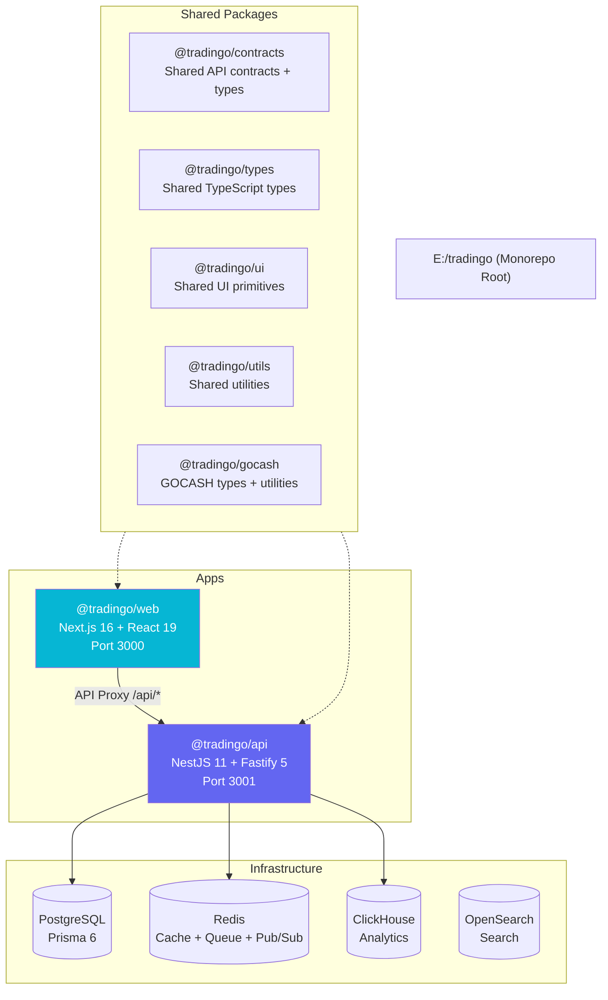
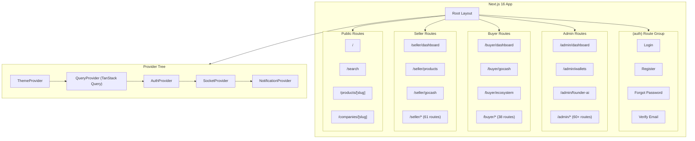
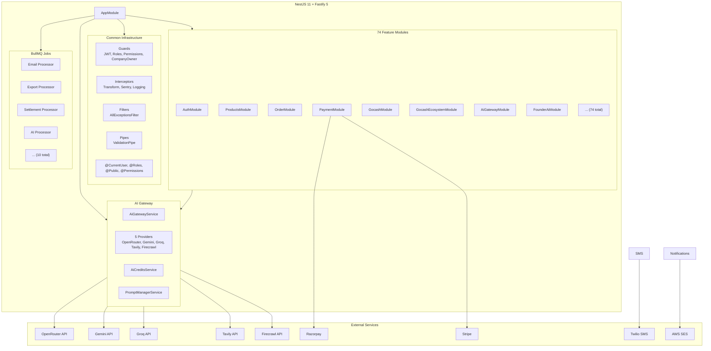
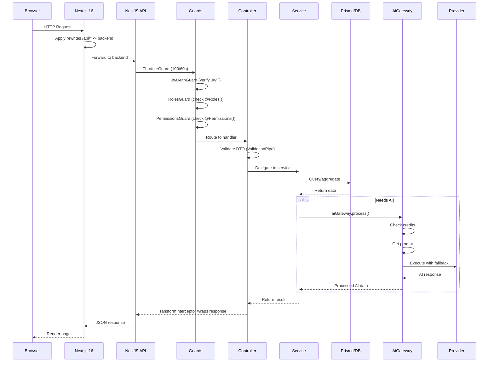

# TRADINGO Architecture

## Monorepo Architecture

## Frontend Architecture

## Backend Architecture

## Request Lifecycle

## Backend Orchestration

```mermaid
graph LR
    subgraph Auth["Authentication"]
        JWT["JWT Strategy"]
        Google["Google OAuth"]
        LinkedIn["LinkedIn OAuth"]
        Refresh["Refresh Token"]
    end
    
    subgraph Core["Core Modules"]
        Users["Users"]
        Companies["Companies"]
        Categories["Categories"]
        Industries["Industries"]
    end
    
    subgraph Trading["Trading Modules"]
        Products["Products"]
        Rfq["RFQ"]
        Quote["Quote"]
        Negotiation["Smart Negotiation"]
        PO["Purchase Order"]
        Order["Order"]
        Shipment["Smart Shipment"]
        Delivery["Smart Delivery"]
    end
    
    subgraph Finance["Financial Modules"]
        Payments["Payment"]
        Escrow["Escrow"]
        Settlement["Settlement"]
        Credit["Credit/Finance"]
        Invoicing["Billing/Invoicing"]
    end
    
    subgraph Trust["Trust & Verification"]
        TradTrust["TradTrust"]
        KYC["Company Verification"]
        UserKYC["User Verification"]
        Reputation["Reputation Events"]
    end
    
    subgraph Intelligence["Intelligence"]
        TradFind["TradFind Search"]
        TradMatch["TradMatch AI"]
        MarketIntel["Market Intelligence"]
        LocationIntel["Location Intelligence"]
        FreightIntel["Freight Intelligence"]
    end
    
    subgraph Rewards["Rewards & Engagement"]
        GOCASH["GOCASH Wallet"]
        Ecosystem["Ecosystem XP/Levels"]
        Campaign["Campaigns"]
        Referral["Referrals"]
    end
    
    subgraph AI["AI Layer"]
        AiGateway["AI Gateway"]
        AiSearch["Search AI"]
        AiFinance["Finance AI"]
        AiAdmin["Admin AI"]
        AiNegotiation["Negotiation AI"]
        AiRFQ["RFQ AI"]
        AiQuote["Quote AI"]
        FounderAi["Founder AI"]
    end
    
    Auth --> Core
    Core --> Trading
    Trading --> Finance
    Trading --> Trust
    Intelligence --> Trading
    Rewards --> Trading
    AI --> Trading
    AI --> Intelligence
    AI --> Trust
    AI --> Finance
```

## Dependency Rules

1. **Apps cannot depend on other apps** — `@tradingo/api` and `@tradingo/web` are independent
2. **Packages can depend on other packages** — `@tradingo/gocash` depends on `@prisma/client`
3. **Apps depend on packages** — Both apps use `@tradingo/types`, `@tradingo/utils`
4. **No circular dependencies** — enforced by TypeScript module resolution
5. **Shared Prisma schema** — Single `schema.prisma` at monorepo root, consumed by `@tradingo/api`
