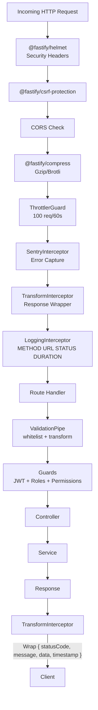

# Core Infrastructure Blueprint

## API Middleware Chain

## Feature Flags

> **Status:** Not Yet Implemented

The codebase does not have a formal feature flag system. Environment variables in `apps/api/src/config/app.config.ts` serve as feature toggles. A proper feature flag system (e.g., LaunchDarkly or Unleash) is planned.

## Correlation IDs

> **Status:** Not Yet Implemented

The codebase does not implement a formal correlation ID across distributed requests. Each request is logged independently via `LoggingInterceptor`. Adding UUID-based correlation IDs is a future enhancement.

## Logging

| Layer | Tool | Purpose |
|-------|------|---------|
| API | `LoggingInterceptor` | Logs `METHOD URL STATUS DURATIONms` for every request |
| API | NestJS Logger | Service-level logging via `Logger` |
| API | Sentry | Error tracking with stack traces, breadcrumbs, user context |
| API | BullMQ | Job execution logging (built-in) |
| Frontend | Sentry | Client-side error tracking |
| Frontend | Web Vitals | Performance monitoring |
| Infrastructure | Prometheus | Metrics collection (port 9100) |
| Infrastructure | Grafana | Dashboard visualization |

## Caching Strategy

| Layer | Tool | Cache Strategy | TTL |
|-------|------|---------------|-----|
| AI | Redis | MD5 hash of taskType+payload | 3600s (default) |
| AI | Idempotency | Redis key dedup | Per-key |
| API | Redis | `RedisService` (get/set/del) | Per-use-case |
| Frontend | React Query | In-memory cache with stale-while-revalidate | Per-query |
| Frontend | Zustand persist | localStorage | Persistent |
| Database | PostgreSQL | Connection pooling via Prisma | N/A |

## Plugin Architecture

**Backend**: NestJS module system with `@Global()` decorators for PrismaModule and RedisModule. All feature modules are self-contained and imported in `app.module.ts`.

**Frontend**: Component-based architecture with shared `ui/` components library. Zustand stores for global state. React Query for server state.

## Observability

| Concern | Tool | Metrics |
|---------|------|---------|
| Metrics | Prometheus | HTTP request count, duration, errors |
| Dashboards | Grafana | Pre-built JSON dashboard at `monitoring/grafana-dashboard.json` |
| Error Tracking | Sentry | All exceptions (API + frontend) |
| Health Checks | HealthController | `GET /live`, `GET /ready`, `GET /health` |
| Performance | Web Vitals | CLS, LCP, FID, INP (frontend) |
| AI Performance | UsageTrackerService | Token counts, latency, cost per provider per task |
| Business Analytics | ClickHouse | Event analytics, funnel analysis |
