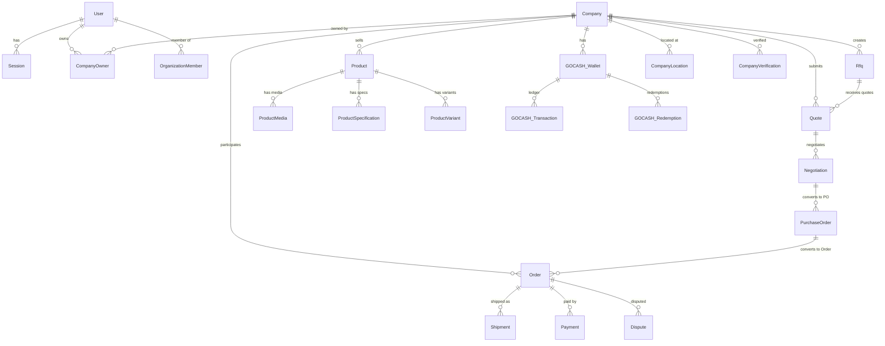

# TRADINGO Database Overview

## Database Architecture

- **Primary Database**: PostgreSQL 16 (via Prisma 6 ORM)
- **Analytics Database**: ClickHouse (columnar, event analytics)
- **Cache Layer**: Redis (caching, pub/sub, BullMQ queues)
- **Search Index**: OpenSearch (full-text, faceted, geo-spatial)

## PostgreSQL Schema (Prisma)

**Total Models**: 231
**Total Enums**: 160
**Total Fields**: ~3,354
**Total Indexes**: 620 `@@index` directives
**Total Unique Constraints**: 45 `@@unique` directives
**Total Relations**: ~248 `@relation` directives

## Entity Relationship Patterns

## OnDelete Policy Summary

| Policy | Count | When Used |
|--------|-------|-----------|
| `Cascade` | 140 | Child/detail records (OrderItem, ProductMedia, Message, InvoiceItem) |
| `Restrict` | 54 | Critical business chain (Payment, Escrow, Dispute, Quote, Negotiation) |
| `SetNull` | 54 | Optional/soft-link relations (reviewer, parent category, message reply) |
| `NoAction` | 6 | Archival analytics (GoCashTransaction, PlanHistory, RfqAnalytics) |

## Soft Delete (14 models)

Models with `deletedAt DateTime?` field:

- User, Organization, Company, CompanyLocation
- Product, ProductClaim, Rfq, Quote
- Order, Dispute, Shipment, Delivery
- Notification, NotificationTemplate

All are indexed with `@@index([deletedAt])` for filtered query performance.

## Indexing Strategy

- Every foreign key has an index
- High-query models have 8-10 indexes each (Shipment: 10, Order/Product/Dispute: 9)
- Date-range queries indexed on `createdAt`
- Composite indexes for common query patterns
- Full-text search handled by OpenSearch (not PostgreSQL)

## Transaction Strategy

- Prisma `$transaction` for atomic operations (GOCASH credit/debit, order creation, payment capture)
- Idempotency keys for financial operations (Prevents duplicate GOCASH credits)
- BullMQ for async transaction processing (Settlement, Escrow release)
- No distributed transactions — eventual consistency for cross-service operations

## Naming Conventions

- **Models**: PascalCase, singular (User, Company, Product, GOCASH_Wallet)
- **Fields**: camelCase (firstName, createdAt, currentBalance)
- **Enums**: PascalCase with full words (VerificationStatus, NotificationType)
- **Relation fields**: camelCase with Id suffix (companyId, ownerId)
- **Join tables**: Implicit (Prisma handles relation tables)
- **Indexes**: Auto-named by Prisma
- **Deletable**: `deletedAt` for soft delete, never hard delete
