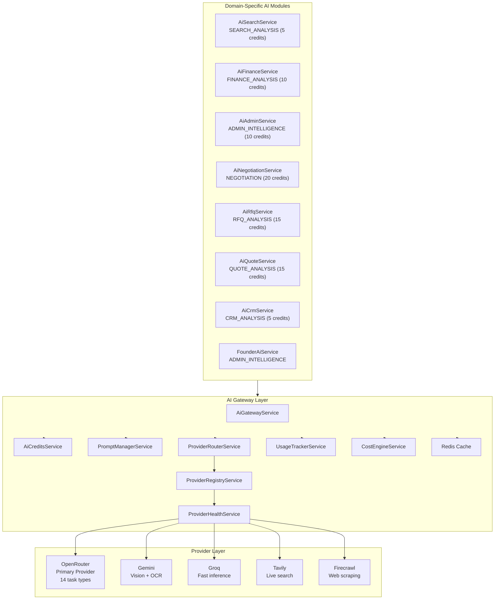
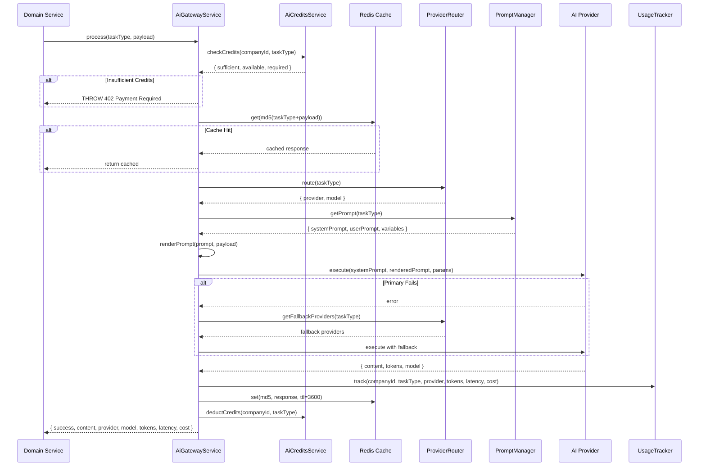

# TRADINGO AI Architecture

> The complete AI ecosystem: Gateway, providers, credits, prompts, and domain-specific modules.

## Architecture Overview

## AI Request Flow

## Task Types & Credit Costs (19 values)

| TaskType | Credits | Default Provider | Models |
|----------|---------|-----------------|--------|
| PRODUCT_DESCRIPTION | 10 | OpenRouter | gpt-4o-mini, gpt-4o, gemini-2.0-flash |
| SEO_GENERATION | 5 | OpenRouter | gpt-4o-mini |
| TRANSLATION | 8 | OpenRouter | gpt-4o-mini |
| SPEC_SUGGESTION | 3 | Groq | llama3-70b, mixtral |
| IMAGE_SUGGESTION | 3 | OpenRouter | gpt-4o-mini |
| QUALITY_SCORING | 2 | Gemini | gemini-2.0-flash |
| DUPLICATE_DETECTION | 5 | Gemini | gemini-2.0-flash |
| OCR | 10 | Gemini | gemini-2.0-pro, gemini-1.5-pro |
| FAST_SUGGESTION | 1 | Groq | llama3-8b |
| LIVE_SEARCH | 2 | Tavily | tavily-search |
| WEBSITE_IMPORT | 15 | Firecrawl | firecrawl-scrape |
| RFQ_ANALYSIS | 15 | OpenRouter | gpt-4o-mini, gemini-2.0-flash |
| QUOTE_ANALYSIS | 15 | OpenRouter | gpt-4o-mini, gemini-2.0-flash |
| NEGOTIATION | 20 | OpenRouter | gpt-4o-mini |
| CRM_ANALYSIS | 5 | OpenRouter | gpt-4o-mini |
| FINANCE_ANALYSIS | 10 | OpenRouter | gpt-4o-mini, gemini-2.0-flash |
| SEARCH_ANALYSIS | 5 | OpenRouter | gpt-4o-mini, gemini-2.0-flash |
| ADMIN_INTELLIGENCE | 10 | OpenRouter | gpt-4o-mini, gemini-2.0-flash |
| GENERAL_CHAT | 1 | Groq | llama3-70b |

## Plan Credit Allocations

| Plan | Monthly Credits |
|------|-----------------|
| TRAD UP | 20 |
| Trade Start | 50 |
| Trade Smart | 100 |
| Trade Plus | 250 |
| Trade Pro | 500 |
| Trade Premium | 1000 |
| Trade Elite | 2500 |

## Provider Configuration

| Provider | Default Model | Supported Tasks | Fallback Order |
|----------|--------------|-----------------|----------------|
| OpenRouter | gpt-4o-mini | 14 (all except LIVE_SEARCH, WEBSITE_IMPORT) | 1st |
| Gemini | gemini-2.0-flash | 4 (OCR, scoring, detection) | 2nd |
| Groq | llama3-70b | 3 (fast suggestion, specs, chat) | 3rd |
| Tavily | tavily-search | 1 (LIVE_SEARCH) | 4th |
| Firecrawl | firecrawl-scrape | 1 (WEBSITE_IMPORT) | 5th |

## Circuit Breaker

- **Threshold**: 5 consecutive failures
- **Cooldown**: 60 seconds
- **Scope**: Per provider
- **State**: `ACTIVE` → `DEGRADED` (after circuit opens) → `ACTIVE` (after cooldown + success)

## Prompt Management

- **Storage**: `AiPrompt` Prisma model
- **Versioning**: `@@unique([taskType, version])`
- **Activation**: Only one active version per taskType
- **Variables**: `{{variableName}}` template syntax
- **Rendering**: `renderPrompt()` replaces variables with payload values
- **Fallback**: Generic prompt created if none exists for taskType
- **Auto-seed**: Each AI sub-module seeds its prompt on `onModuleInit()`

## Frontend AI Integration

All AI modules have matching frontend:
- `lib/api/<module>.ts` — Typed API functions
- `hooks/use-<module>.ts` — React Query hooks
- `components/<module>/ai-<module>-copilot.tsx` — Reusable copilot component

Frontend pages with AI integration:
- `/seller/ai-workspace` — Seller AI dashboard
- `/admin/ai-console` — Admin AI intelligence console
- `/admin/ai-infrastructure` — Provider management
- `/admin/ai-credits` — Credit management
- `/admin/founder-ai` — Founder AI command center
- `/seller/products/[id]/edit` — AI CopilotPanel sidebar
- `/admin/dashboard` — AI copilot toggle
- `/search` — AI Search copilot

## Future AI Enhancements

> **Status:** Not Yet Implemented

- **RAG pipeline**: Document retrieval for enhanced AI responses
- **Fine-tuned models**: Domain-specific fine-tuning for B2B trade
- **Voice interface**: Speech-to-text for Founder AI
- **Multi-modal product search**: Image-based product search
- **Auto-negotiation**: AI-driven autonomous negotiation
- **Predictive analytics**: ML model-based predictions
