# TRADINGO Event Bus Architecture

## Architecture Overview

TRADINGO uses BullMQ (powered by Redis) for asynchronous job processing. There is no formal domain event bus — instead, services call each other directly or through the BullMQ job queue system.

```mermaid
graph TD
    subgraph Producers["Job Producers"]
        Controllers["Controllers"]
        Services["Services"]
        JobScheduler["JobSchedulerService (Cron)"]
    end
    
    subgraph Redis["Redis (BullMQ)"]
        EmailQ["EMAIL Queue"]
        ExportQ["EXPORT Queue"]
        NotificationQ["NOTIFICATION Queue"]
        CertQ["CERTIFICATION Queue"]
        SubscriptionQ["SUBSCRIPTION Queue"]
        RFQQ["RFQ Queue"]
        EscrowQ["ESCROW Queue"]
        SettlementQ["SETTLEMENT Queue"]
        DisputeQ["DISPUTE Queue"]
        AnalyticsQ["ANALYTICS Queue"]
        MalwareQ["MALWARE Queue"]
        BestsellerQ["BESTSELLER Queue"]
        AIQ["AI Queue"]
    end
    
    subgraph Workers["Job Processors"]
        EmailProc["email.processor"]
        ExportProc["export.processor"]
        NotificationProc["notification.processor"]
        CertProc["certification.processor"]
        SubscriptionProc["subscription.processor"]
        RFQProc["rfq.processor"]
        EscrowProc["escrow.processor"]
        SettlementProc["settlement.processor"]
        DisputeProc["dispute.processor"]
        AnalyticsProc["analytics.processor"]
        MalwareProc["malware.processor"]
        BestsellerProc["bestseller.processor"]
        AIProc["ai.processor"]
    end
    
    Producers --> Redis
    Redis --> Workers
```



## Queue Definitions

> Source: `apps/api/src/jobs/queues.ts`

### Job Data Interfaces

Each queue has typed job data:

```typescript
// EMAIL Queue
interface EmailJobData {
  to: string | string[]
  subject: string
  body: string
  template?: string
  attachments?: Array<{ filename: string; content: string }>
}

// EXPORT Queue
interface ExportJobData {
  companyId: string
  type: 'CSV' | 'EXCEL'
  filters: Record<string, any>
  includeHeaders: boolean
}

// NOTIFICATION Queue
interface NotificationJobData {
  notificationId: string
  channel: string
  recipientId: string
  template: string
  variables: Record<string, any>
}

// AI Queue
interface AIJobData {
  companyId: string
  type: string
  payload: Record<string, any>
}

// ... (Similar interfaces for all 13 queues)
```

## Job Processors

| Processor | Purpose | Behavior |
|-----------|---------|----------|
| email.processor | Sends transactional emails via AWS SES | Retry on failure |
| export.processor | Generates CSV/PDF exports | Progress tracking |
| notification.processor | Processes notification delivery (in-app/email/SMS) | Channel dispatch |
| certification.processor | Checks certification expiry, recalculates trust | Scheduled |
| subscription.processor | Checks renewal, applies grace, auto-expires | Daily cron |
| rfq.processor | Expires RFQs, credit packs, quotes | Scheduled |
| escrow.processor | Auto-release, expiry monitoring | Scheduled |
| settlement.processor | Process settlements and retries | Retry on failure |
| dispute.processor | Expire disputes, SLA breach alerts | Scheduled |
| analytics.processor | Batch analytics processing | Periodic |
| malware.processor | File scan processing | On-demand |
| bestseller.processor | Weekly bestseller calculation | Weekly cron |
| ai.processor | Bulk AI processing (descriptions, SEO, translations) | Batch |

## Job Scheduler

`job-scheduler.service.ts` handles recurring jobs:
- **Bestseller calculation**: Weekly
- **Certification expiry checks**: Daily
- **Subscription management**: Daily
- **RFQ expiry**: Hourly
- **Escrow auto-release**: Hourly
- **Settlement processing**: Continuous
- **Dispute SLA monitoring**: Hourly

## Domain Event Pattern

TRADINGO does not use a formal domain event bus (e.g., NestJS EventEmitter or CQRS event bus). Domain events are handled through:

1. **Direct service calls** — Service A calls Service B's method directly
2. **BullMQ jobs** — For async/time-consuming tasks
3. **Dedicated integration layer** — `GocashIntegrationService` handles cross-domain rewards

### Example: Order Completed → GOCASH Reward

```typescript
// order.service.ts
async completeOrder(orderId: string) {
  const order = await this.prisma.order.update({ where: { id: orderId }, data: { status: 'COMPLETED' } });
  // Direct service call (no event bus)
  await this.gocashIntegration.awardOrderCompleted({ companyId: order.buyerCompanyId, orderId: order.id });
}
```

## Outbox Pattern

> **Status:** Not Yet Implemented

The codebase does not implement a transactional outbox pattern. This is a future enhancement for guaranteed event delivery.

## Correlation IDs

> **Status:** Not Yet Implemented

Correlation IDs across distributed requests are not implemented. Each request is logged independently. This is a future enhancement for distributed tracing.

## Retry & Dead Letter Queue

- **Retry**: BullMQ's built-in retry with exponential backoff (configurable per queue)
- **Dead Letter Queue**: Not explicitly implemented — failed jobs are logged via Sentry
- **Job Failure Handling**: Each processor wraps logic in try/catch, logs error, and optionally retries
