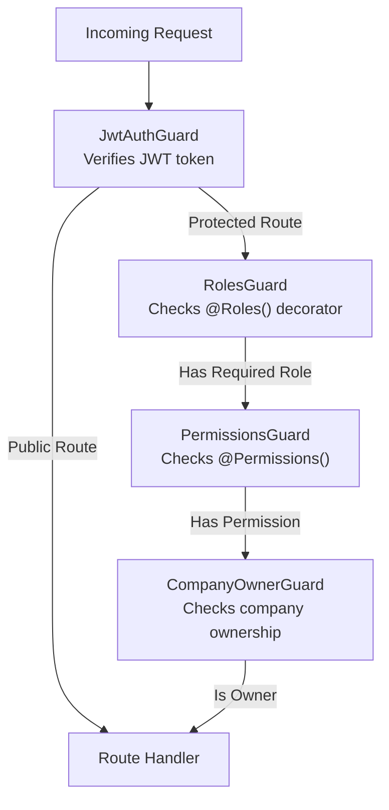

# TRADINGO RBAC/ABAC

## Authorization Architecture

TRADINGO uses a layered authorization model combining Role-Based Access Control (RBAC) with some Attribute-Based Access Control (ABAC) elements via the `CompanyOwnerGuard`.

## Roles (7 roles)

| Role | Level | Description |
|------|-------|-------------|
| `SUPER_ADMIN` | 100 | Full system access, all operations |
| `ADMIN` | 80 | Platform administration, no super-admin functions |
| `MANAGER` | 60 | Department management |
| `SELLER` | 40 | Seller workspace access |
| `BUYER` | 20 | Buyer workspace access |
| `RM` | 30 | Relationship Manager access |
| `VIEWER` | 10 | Read-only access |

## Guards

### JwtAuthGuard
- **File**: `apps/api/src/common/guards/jwt-auth.guard.ts`
- **Strategy**: Passport JWT strategy
- **Public bypass**: Routes with `@Public()` decorator skip JWT check
- **Token**: JWT with access token + refresh token flow

### RolesGuard
- **File**: `apps/api/src/common/guards/roles.guard.ts`
- **Usage**: `@Roles('ADMIN', 'SUPER_ADMIN')`
- **Logic**: OR — user.role must match ANY of the specified roles
- **No @Roles() decorator**: Route is accessible to all authenticated users

### PermissionsGuard
- **File**: `apps/api/src/common/guards/permissions.guard.ts`
- **Usage**: `@Permissions('users:write', 'users:delete')`
- **Logic**: AND — user must have ALL specified permissions
- **SUPER_ADMIN bypass**: SUPER_ADMIN role automatically passes all permission checks

### CompanyOwnerGuard
- **File**: `apps/api/src/common/guards/company-owner.guard.ts`
- **Purpose**: Verifies user is owner of a company via `CompanyOwner` table
- **Usage**: On routes that require company-level ownership

## Decorators

| Decorator | Purpose | Used On |
|-----------|---------|---------|
| `@Public()` | Marks route as public (no JWT required) | Auth endpoints |
| `@Roles('ADMIN')` | Specifies required roles | Admin endpoints |
| `@Permissions('perm')` | Specifies required permissions | Fine-grained access |
| `@CurrentUser()` | Extracts authenticated user from request | Any protected route |

## Ownership Model

- **Company**: Each company has one or more owners via `CompanyOwner` table (unique on `[companyId, userId]`)
- **User**: Each user has a primary role
- **Organization**: Multi-tenant via `Organization` table with members

## Authorization Flow for Typical Operations

1. **Public routes**: `/products`, `/companies` — No auth required
2. **Buyer operations**: `/buyer/*` — JWT + Role=BUYER (implicit, no explicit guard)
3. **Seller operations**: `/seller/*` — JWT + Role=SELLER
4. **Admin operations**: `/admin/*` — JWT + `@Roles('ADMIN', 'SUPER_ADMIN')`
5. **Company-owned resources**: Route + `CompanyOwnerGuard` — JWT + correct companyId
6. **AI endpoints**: JWT + role guard + credit check (402 if insufficient)

## ABAC Policy

> **Status:** Not Yet Implemented in code (document exists at `security/ABAC-POLICY.md`)

The ABAC policy document exists but the `PermissionsGuard` and granular permission checks are not yet fully implemented across all endpoints. Current implementation relies primarily on role-based checks.
