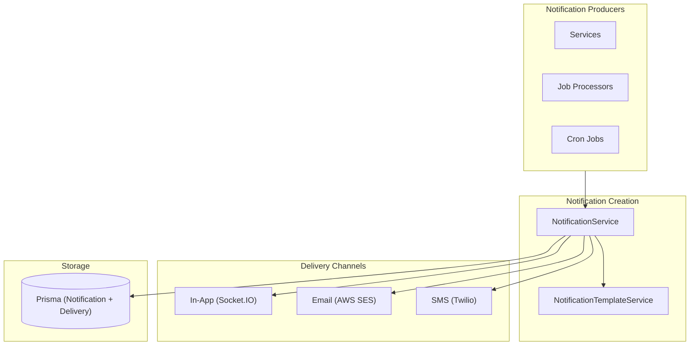

# TRADINGO Notification Architecture

## Overview

Multi-channel notification system supporting in-app, email, SMS, and push notifications with template management.

## Channels

| Channel | Type | Provider | Status |
|---------|------|----------|--------|
| In-App | Real-time push | Socket.IO | ✅ Existing |
| Email | Transactional | AWS SES (via EmailProcessor) | ✅ Existing |
| SMS | Transactional | Twilio (via SmsService) | ✅ Existing |
| Push | Mobile push | Not Yet Implemented | ⬜ Future |

## Architecture

## Notification Templates

> Source: `apps/api/src/modules/notification/notification.template.service.ts`

Templates are stored per `[type, channel]` in `NotificationTemplate` model with fallback templates.

### Notification Types (135 values)

Organized into categories:
- **RFQ** (9): RFQ_MATCHED, RFQ_QUOTE_RECEIVED, RFQ_ACCEPTED, RFQ_EXPIRED, etc.
- **Negotiation** (6): NEGOTIATION_RECEIVED, COUNTER_OFFER, NEGOTIATION_ACCEPTED, etc.
- **PO** (6): PO_GENERATED, PO_CONFIRMED, PO_SELLER_ACCEPTED, PO_EXPIRED, etc.
- **Order** (12): ORDER_CONFIRMED, ORDER_SHIPPED, ORDER_DELIVERED, ORDER_CANCELLED, etc.
- **Shipment** (8): SHIPMENT_CREATED, SHIPMENT_DISPATCHED, SHIPMENT_DELIVERED, etc.
- **Delivery** (6): DELIVERY_OUT_FOR_DELIVERY, DELIVERY_CONFIRMED, DELIVERY_FAILED, etc.
- **Payment** (4): PAYMENT_RECEIVED, PAYMENT_FAILED, REFUND_PROCESSED, etc.
- **GOCASH** (5): GOCASH_CREDITED, GOCASH_DEBITED, GOCASH_REWARD, etc.
- **Subscription** (6): SUBSCRIPTION_ACTIVATED, SUBSCRIPTION_EXPIRING, etc.
- **Escrow** (8): ESCROW_HELD, ESCROW_RELEASED, ESCROW_DISPUTED, etc.
- **Settlement** (8): SETTLEMENT_PROCESSED, SETTLEMENT_FAILED, etc.
- **Dispute** (13): DISPUTE_OPENED, DISPUTE_RESOLVED, EVIDENCE_REQUESTED, etc.
- **KYC/Verification** (9): KYC_SUBMITTED, KYC_APPROVED, KYC_REJECTED, etc.
- **Ecosystem** (13): MISSION_COMPLETED, BADGE_EARNED, LEVEL_UP, DAILY_CHECKIN, REWARD_EXPIRING, LEADERBOARD_IMPROVED, CAMPAIGN_STARTED, CAMPAIGN_ENDING, AI_SUGGESTED_MISSION, REFERRAL_REWARD, REFERRAL_MILESTONE, MEMBERSHIP_UPGRADED, MEMBERSHIP_EXPIRING, AI_CREDIT_ADDED
- **Other** (25+): Chat, Trust, Company, Onboarding, General, System, etc.

## Delivery Flow

1. Service calls `NotificationService.createWithTemplate(type, recipient, variables)`
2. `NotificationTemplateService` resolves the template for `[type, channel]`
3. Fallback templates provide default content if no custom template exists
4. Notification is created in DB with `NotificationStatus.PENDING`
5. In-app: Real-time delivery via Socket.IO to user
6. Email: Queued to `EMAIL` BullMQ queue → `email.processor.ts` → AWS SES
7. SMS: Direct call to `SmsService.send()` → Twilio

## Preferences

Users can configure per-channel, per-type notification preferences stored in `NotificationPreference` model (unique on `[companyId, userId, channel, type]`).

## Notification Gateway (WebSocket)

- **Provider**: Socket.IO with Redis adapter for horizontal scaling
- **Events**: `notification` — Real-time push to connected clients
- **Room**: Per-user room for targeted delivery
- **Namespace**: `/notifications`
