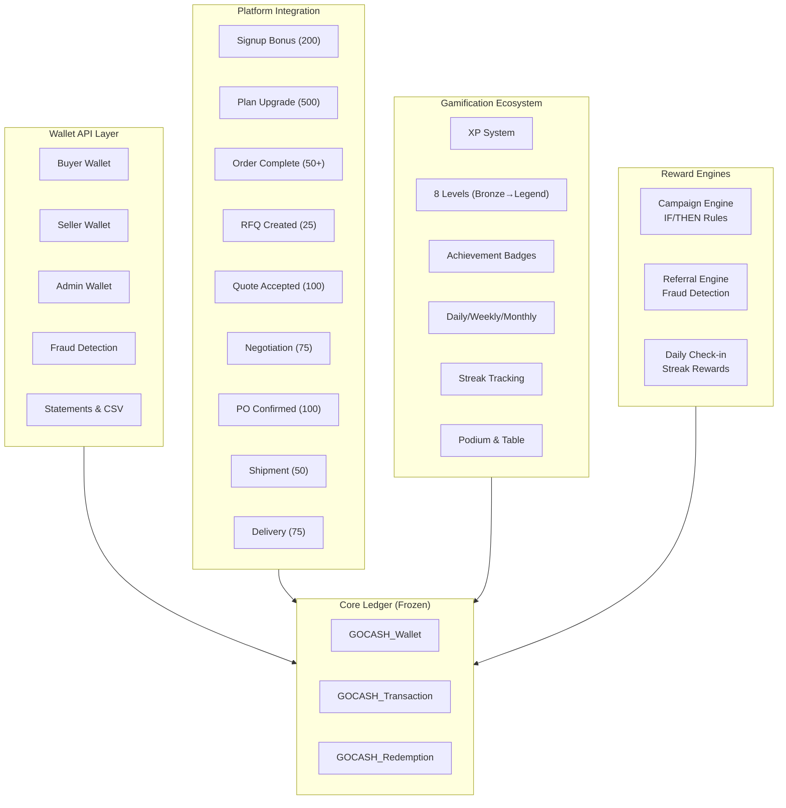

# TRADINGO GOCASH Ecosystem

## Overview

GOCASH is TRADINGO's rewards and wallet engine — a complete gamification and incentive system that spans the entire platform.

## Architecture

## Core Ledger (GOCASH_Wallet + GOCASH_Transaction)

**Status**: ❄️ FROZEN — Do not modify

### Wallet
- `currentBalance` / `availableBalance` / `pendingBalance` / `lockedBalance` / `expiredBalance`
- `lifetimeEarned` / `lifetimeRedeemed` / `lifetimeExpired`
- Status: ACTIVE / LOCKED / SUSPENDED / EXPIRED
- Unique per userId

### Transaction (Append-only Ledger)
- `direction`: CREDIT / DEBIT
- `status`: PENDING / SUCCESS / FAILED / REVERSED
- `type`: 16 transaction types (SIGNUP_BONUS → ADMIN_CORRECTION)
- `idempotencyKey`: Unique per key (prevents duplicate processing)
- `balanceBefore` / `balanceAfter`: Immutable balance snapshot

### Idempotency
Every financial operation uses `idempotencyKey` (format: `REFERENCE_TYPE_refId_userId`). The `verifyIdempotency()` method checks Redis then DB before processing.

## Wallet API (22 endpoints)

- **Buyer**: Summary, Balance, Transactions, Rewards, Statement
- **Seller**: Summary, Transactions, Statement, Analytics
- **Admin**: Search, Detail, Freeze/Unfreeze, Manual Credit/Debit, Adjust, Reverse, Fraud Alerts
- **Analytics**: Growth, Distribution, Top Wallets, Redemption Trends

## Platform Integration Rewards

| Event | Amount | Parties |
|-------|--------|---------|
| Membership Signup | 200 | Buyer/Seller |
| Plan Upgrade | 500 | Buyer/Seller |
| Order Completed (base) | 50 | Buyer |
| Order Milestone 10 | 200 | Buyer |
| Order Milestone 50 | 1000 | Buyer |
| Order Milestone 100 | 2500 | Buyer |
| RFQ Created | 25 | Buyer |
| Quote Accepted | 100 | Both Buyer + Seller |
| Negotiation Completed | 75 | Both |
| PO Confirmed | 100 | Seller |
| Shipment Delivered | 50 | Seller |
| Delivery Confirmed | 75 | Buyer |

## Gamification Ecosystem

### XP System (33 XP Reasons)
LOGIN, RFQ_CREATE, QUOTE_SUBMIT, ORDER_COMPLETE, PRODUCT_UPLOAD, REFERRAL_SEND, AI_USE, REVIEW_GIVE, KYC_COMPLETE, PROFILE_COMPLETE, NEGOTIATION_WIN, DELIVERY_CONFIRM, PAYMENT_MAKE, CAMPAIGN_JOIN, SEARCH_USE, CHAT_MESSAGE + more

### Levels (8)
BRONZE → SILVER → GOLD → PLATINUM → DIAMOND → TITANIUM → ELITE → LEGEND

### Missions
Periodic (DAILY / WEEKLY / MONTHLY) with XP + GOCASH + Badge rewards

### Streaks
DAILY_CHECKIN, WEEKLY_MISSION, MONTHLY_MISSION — with bonus rewards at milestones

### Leaderboards
DAILY / WEEKLY / MONTHLY / YEARLY periods, across BUYER / SELLER / RM / CITY / STATE / INDUSTRY / CATEGORY categories

## Campaign Engine

- 13 CampaignTypes (SIGNUP, MEMBERSHIP, CASHBACK, FESTIVAL, REFERRAL, SELLER, BUYER, CATEGORY, PRODUCT, ORDER, COUPON, LIMITED_TIME, AI)
- IF/THEN rule engine (9 operators)
- Budget engine (total/spent/remaining, per-user/company/daily/max limits)
- Eligibility engine (status, dates, budget, limits, fraud)
- All rewards via idempotent GOCASH credit

## Referral Engine

- Code format: `TRAD` + 10 hex chars
- Fraud detection: Self-referral, disposable email, blacklist (IP/Device/Email/Domain), velocity (3 per 10min)
- Rewards: Idempotent GOCASH `REFERRAL_REWARD` credit
- 6 ReferralCodeTypes: BUYER, SELLER, MEMBERSHIP, CAMPAIGN, INVITATION, AFFILIATE
