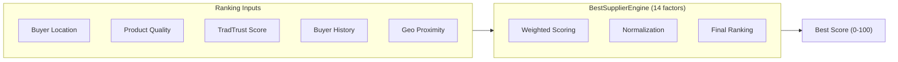

# TRADINGO Marketplace Intelligence

## Near → Far → Best™ Engine

TRADINGO's proprietary ranking system that balances proximity with quality.

### TradTrust Scoring (6 Dimensions)

| Dimension | Weight | Source |
|-----------|--------|--------|
| Profile Completeness | 15% | Company profile data |
| Verification Level | 20% | KYC/Verification status |
| Transaction History | 25% | Order volume, completion rate |
| Reviews & Ratings | 20% | Buyer reviews, average rating |
| Compliance Score | 10% | Certification, documentation |
| Longevity | 10% | Platform tenure, activity consistency |

### Location Intelligence Module

7 endpoints under `/location-intelligence/`:
- Geocode address → lat/lng
- Auto-geocode unlocated companies
- Nearby search by radius
- Geo clusters by region
- User preferences management
- Territory hierarchy management

### Marketplace Intelligence Module

2 endpoints:
- `GET /marketplace-intelligence/best-supplier` — 14-factor supplier ranking
- `GET /marketplace-intelligence/buyer-history` — Buyer behavioral history

### Near-Me Module

Location-aware product/company discovery with Leaflet map integration (15 frontend components).

## Analytics

### ClickHouse Integration
- Event analytics for platform metrics
- Funnel analysis (signup → first order → repeat order)
- Daily/weekly/monthly aggregation

### API Analytics
- Admin dashboard analytics (GMV, users, orders, RFQs, disputes, payments)
- Seller analytics (products, orders, RFQs, revenue)
- Buyer analytics (saved products, RFQs, orders, spending)

## Market Intelligence
Category trends, pricing analysis, demand forecasting (via AI).

## Freight Intelligence
Shipping cost estimation, carrier comparison, route optimization.

## Territory Intelligence
Regional market analysis, territory clustering, expansion recommendations.

## BestSeller Engine
Weekly bestseller snapshots at product, category, and seller levels via `bestseller.processor.ts`.
