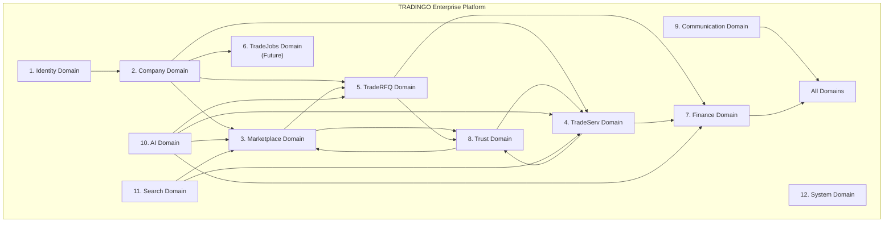
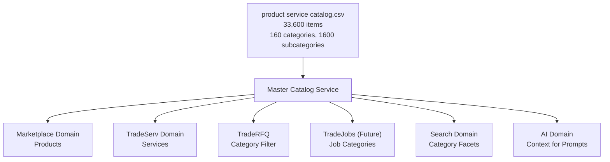
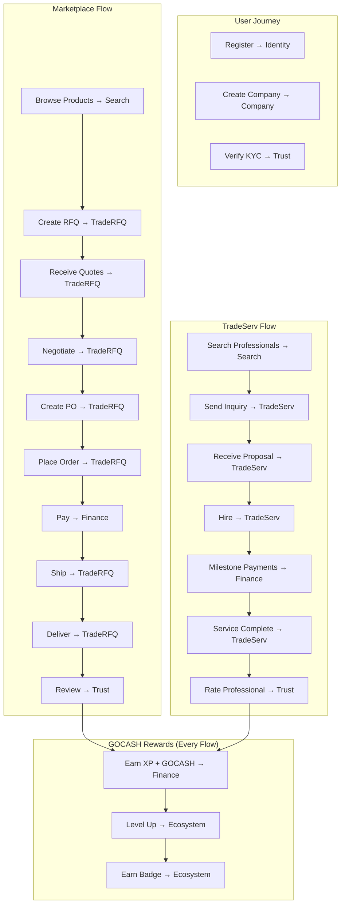
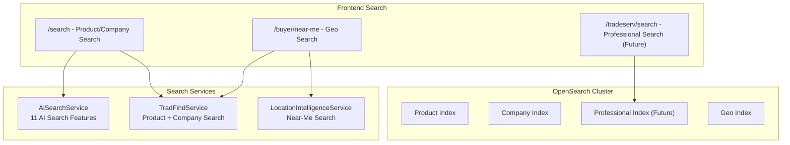
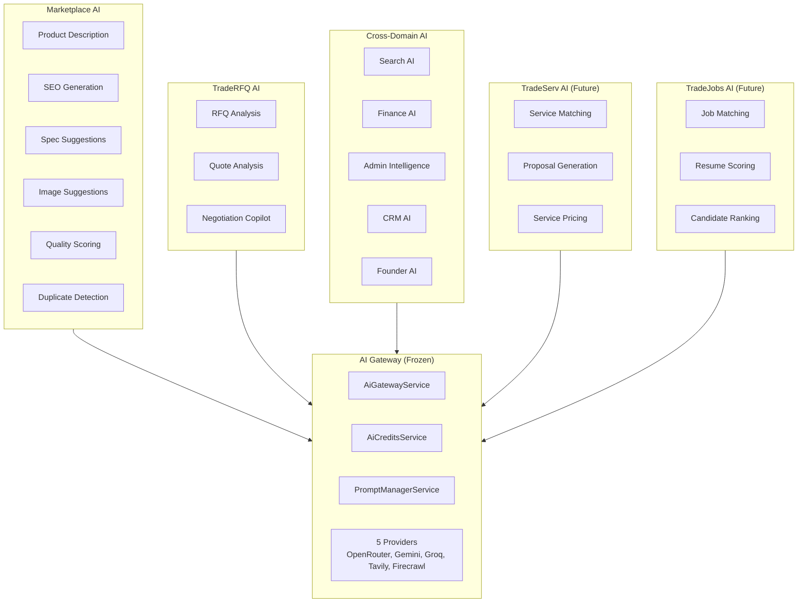
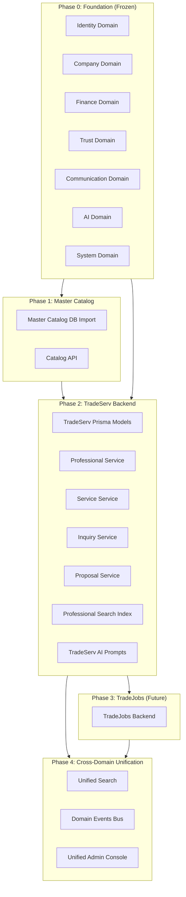

# TRADINGO® Enterprise Domain Model & Master Catalog Architecture

> **Version**: 1.0 — Architecture Contract
> **Status**: PRE-IMPLEMENTATION FREEZE — NO CODE UNTIL APPROVED
> **Date**: 2026-07-04
> **Scope**: Marketplace · TradeServ · TradeRFQ · TradeJobs · TradePay · TradeAI · Future Ecosystem Modules

---

## Table of Contents

1. [Enterprise Domain Model](#part-1-enterprise-domain-model)
2. [Master Catalog Domain](#part-2-master-catalog-domain)
3. [Domain Ownership](#part-3-domain-ownership)
4. [Cross-Domain Communication](#part-4-cross-domain-communication)
5. [Shared Kernel](#part-5-shared-kernel)
6. [Module Integration](#part-6-module-integration)
7. [Master Data](#part-7-master-data)
8. [Search Strategy](#part-8-search-strategy)
9. [AI Strategy](#part-9-ai-strategy)
10. [Implementation Order](#part-10-implementation-order)
11. [Risks](#part-11-risks)
12. [Founder Recommendations](#part-12-founder-recommendations)

---

## PART 1
## Enterprise Domain Model

### Overview

The TRADINGO platform is organized into **12 primary bounded contexts (domains)** and **4 shared cross-cutting domains**. Each primary domain owns its data, its behavior, and its lifecycle. No domain reaches into another domain's data store. Cross-domain communication happens exclusively through domain events (see Part 4).

The 4 shared cross-cutting domains — **Media** (section 13), **Document** (section 14), **Contact** (section 15), and **Address** (section 16) — provide foundational value objects and services consumed by all primary domains. Additionally, the **AI Gateway**, **Search**, and **Trust (TradTrust)** domains are global shared domains that serve the entire platform while maintaining their own bounded context.



---

### 1. Identity Domain

**Owner**: Identity Domain
**Aggregate Root**: `User`
**Value Objects**: `Password`, `Token`, `Session`, `Otp`
**Shared Kernel**: `Role`, `Permission`

#### Core Entities

| Entity | Type | Description | Existing Prisma Model |
|--------|------|-------------|----------------------|
| User | Aggregate Root | Platform user with authentication | `User` ✅ |
| Session | Entity | Active login session | `Session` ✅ |
| OtpCode | Value Object | One-time password for verification | Embedded in AuthService |
| Role | Enum | SUPER_ADMIN, ADMIN, MANAGER, SELLER, BUYER, RM, VIEWER | `Role` enum ✅ |
| Permission | Value Object | Granular access permission | Permission string |
| IdentityProvider | Value Object | JWT, Google, LinkedIn | Embedded in strategies |

#### Constraints
- User.email is the unique identity key
- A User may have multiple Sessions (one per device)
- A User has exactly one Role
- A User may belong to multiple Companies (via CompanyOwner)
- A User must have verified email/mobile before becoming SELLER

#### Existing Coverage
- ✅ 7 controllers (Auth, Users)
- ✅ JWT + refresh token + Google + LinkedIn OAuth
- ✅ RBAC with RolesGuard + PermissionsGuard
- ✅ Email/mobile verification flow
- ✅ Password hashing (bcrypt) + forgot/reset/change password

---

### 2. Company Domain

**Owner**: Company Domain
**Aggregate Root**: `Company`
**Value Objects**: `Address`, `BusinessIdentity`, `GstDetail`, `PanDetail`
**Shared Kernel**: `Contact`, `Money`, `Geo`

#### Core Entities

| Entity | Type | Description | Existing Prisma Model |
|--------|------|-------------|----------------------|
| Company | Aggregate Root | Business entity (seller, buyer, professional) | `Company` ✅ (113 fields) |
| CompanyOwner | Entity | Links User → Company with ownership | `CompanyOwner` ✅ |
| CompanyLocation | Entity | Branch/warehouse/factory addresses | `CompanyLocation` ✅ |
| CompanyVerification | Entity | KYC verification record | `CompanyVerification` ✅ |
| CompanyVerificationDocument | Entity | Uploaded KYC documents | `CompanyVerificationDocument` ✅ |
| CompanyCertification | Entity | Business certifications (MSME, ISO, etc.) | `CompanyCertification` ✅ |
| CompanyCategory | Entity | Category membership | `CompanyCategory` ✅ |
| CompanyIndustry | Entity | Industry membership | `CompanyIndustry` ✅ |
| Membership | Entity | Current subscription plan | Embedded in Company.currentPlan |
| TeamMember | Value Object | Employee/team member | Not Yet Implemented |
| Branch | Value Object | Branch office (type of Location) | `LocationType` enum ✅ |

#### Domain Rules
- A Company must have at least one CompanyOwner
- A Company has exactly one primary location
- A Company must pass KYC (CompanyVerification) to become ACTIVE
- A Company's TrustScore (TradTrust) is recalculated on verification events
- A Company may have zero or more Memberships (one active at a time)

#### Existing Coverage
- ✅ 113-field Company model (largest in schema)
- ✅ 15 controllers (Companies, CompanyLocations, CompanyVerification, Certifications, Gallery, Onboarding, ProfileCompletion, Organizations)
- ✅ 8 aggregate services
- ✅ CompanyOwnerGuard for multi-tenant isolation
- ⬜ **GAP**: No structured TeamMember or Department model
- ⬜ **GAP**: No formal Organization hierarchy beyond flat members

---

### 3. Marketplace Domain

**Owner**: Marketplace Domain
**Aggregate Root**: `Product`, `Category`
**Value Objects**: `ProductSpecification`, `ProductPrice`, `ProductMedia`, `Inventory`
**Shared Kernel**: `Money`, `Media`, `Units`, `Geo`

#### Core Entities

| Entity | Type | Description | Existing Prisma Model |
|--------|------|-------------|----------------------|
| Category | Aggregate Root | Product category (from Master Catalog) | `Category` ✅ |
| SubCategory | Value Object | Subcategory within a category | Embedded in Category |
| Product | Aggregate Root | Sellable product item | `Product` ✅ (65 fields) |
| ProductMedia | Entity | Product images/videos/documents | `ProductMedia` ✅ |
| ProductSpecification | Entity | Technical specifications | `ProductSpecification` ✅ |
| ProductVariant | Entity | Variant (color/size/grade) | `ProductVariant` ✅ |
| ProductPriceSlab | Entity | Tiered pricing | `ProductPriceSlab` ✅ |
| ProductInventory | Entity | Stock tracking | `ProductInventory` ✅ |
| ProductAttribute | Entity | Dynamic attributes | `ProductAttribute` ✅ |
| ProductTranslation | Entity | Multi-language content | `ProductTranslation` ✅ |
| Brand | Entity | Product brand | `Brand` model via seller-product |
| Manufacturer | Entity | Product manufacturer | Manufacturer embedded in Company |
| ProductClaim | Entity | IP/ownership claim | `ProductClaim` ✅ |
| Review | Entity | Product review | `Review` model via Products |
| Wishlist | Entity | Saved/favorited products | `Wishlist` model via Products |
| BestsellerSnapshot | Entity | Weekly bestseller data | `ProductBestsellerSnapshot` ✅ |

#### Domain Rules
- A Product belongs to exactly one Company (seller)
- A Product belongs to exactly one Category
- A Product may have zero or more Variants
- A Product must have at least one ProductMedia (image) to be ACTIVE
- Category tree comes from Master Catalog — NO custom taxonomies
- If Item Type = Product → Marketplace

#### Existing Coverage
- ✅ 18 Prisma models covering catalog, inventory, variants, pricing
- ✅ 15 controllers across Products, SellerProduct, ProductLocation, ProductClaims
- ✅ 6 services (Products, Bestseller, QA, Reviews, Wishlist, Attributes)
- ✅ Brand management
- ✅ Product wizard with 7-step flow
- ✅ Bulk upload + CSV import
- ✅ AI-powered description/SEO/spec generation
- ⬜ **GAP**: Master Catalog CSV not yet imported as database-backed taxonomy
- ⬜ **GAP**: Category → SubCategory → Item hierarchy exists only in frontend data files

---

### 4. TradeServ Domain

**Owner**: TradeServ Domain
**Aggregate Root**: `Professional`, `Service`
**Status**: ⬜ **NOT YET IMPLEMENTED** (21 frontend pages exist, zero backend)

#### Core Entities

| Entity | Type | Description | Status |
|--------|------|-------------|--------|
| Professional | Aggregate Root | Service professional (CA, CS, GST consultant) | ⬜ Not Yet Implemented |
| ProfessionalService | Aggregate Root | Service offering | ⬜ Not Yet Implemented |
| ProfessionalPortfolio | Entity | Work samples and credentials | ⬜ Not Yet Implemented |
| ProfessionalVerification | Entity | Professional KYC | ⬜ Not Yet Implemented |
| ServiceCategory | Value Object | Service category (from Master Catalog) | ⬜ Not Yet Implemented |
| ServiceInquiry | Entity | Buyer inquiry for a service | ⬜ Not Yet Implemented |
| ServiceProposal | Entity | Professional's response to inquiry | ⬜ Not Yet Implemented |
| ServiceReview | Entity | Review of completed service | ⬜ Not Yet Implemented |
| ServiceBooking | Entity | Confirmed service engagement | ⬜ Not Yet Implemented |
| ServiceAnalytics | Entity | Professional dashboard analytics | ⬜ Not Yet Implemented |

#### Domain Rules (Design)
- A Professional is a Company with `BusinessType = SERVICE_PROVIDER`
- Services belong to the **same Master Catalog** as Products (if Item Type = Service → TradeServ)
- A Professional must pass verification before accepting inquiries
- Professional trust scoring uses the same TradTrust engine (adapted weights)
- Cross-domain: A Company can be both Marketplace Seller AND TradeServ Professional
- Inquiries follow the same pattern as RFQ (buyer request → professional response)
- Proposals follow the same pattern as Quote

#### Existing Frontend Coverage
- ✅ 21 frontend pages (hub, categories, profiles, workspace, search)
- ✅ 11 reusable components (GlassCard, ProfessionalCard, InquiryModal, etc.)
- ✅ Nav integration in master-data.ts
- ⬜ **GAP**: Zero backend — no Prisma models, services, controllers, or APIs

---

### 5. TradeRFQ Domain

**Owner**: TradeRFQ Domain
**Aggregate Root**: `Rfq`, `Quote`, `Negotiation`, `PurchaseOrder`
**Value Objects**: `RfqLineItem`, `QuoteLineItem`, `NegotiationCounter`, `PoTerms`

#### Core Entities

| Entity | Type | Description | Existing Prisma Model |
|--------|------|-------------|----------------------|
| Rfq | Aggregate Root | Request for Quotation | `Rfq` ✅ (52 fields) |
| RfqVendorMatch | Entity | AI-matched supplier | `RfqVendorMatch` ✅ |
| Quote | Aggregate Root | Supplier's price quotation | `Quote` ✅ (40 fields) |
| QuoteLineItem | Entity | Per-item pricing in quote | `QuoteLineItem` ✅ |
| QuoteAttachment | Entity | Quote supporting documents | `QuoteAttachment` ✅ |
| Negotiation | Aggregate Root | Price/terms negotiation | `Negotiation` ✅ (37 fields) |
| NegotiationEvent | Entity | Negotiation history event | `NegotiationEvent` |
| PurchaseOrder | Aggregate Root | Formal purchase order | `PurchaseOrder` ✅ (51 fields) |
| SmartRfq | Aggregate Root | Enhanced RFQ with AI | `Rfq` (enhanced via SmartRfqService) |

#### Domain Rules
- RFQ → Quote → Negotiation → PO is the canonical trading flow
- An RFQ can receive multiple Quotes from different suppliers
- A Quote can lead to zero or one Negotiation
- A Negotiation can convert to exactly one PurchaseOrder
- RFQ can target Products (Marketplace) or Services (TradeServ)
- AI-enhanced via SmartRfqService, AiRfqService, AiQuoteService, AiNegotiationService

#### Existing Coverage
- ✅ 5 aggregate models (Rfq, Quote, Negotiation, PO, Order)
- ✅ 15 controllers (SmartRfq, Quote, SmartNegotiation, SmartPO, Order)
- ✅ 5 backend services + 4 AI services
- ✅ Full frontend flow (buyer + seller)
- ⬜ **GAP**: TradeServ RFQ/Inquiry not yet wired (same pattern, different entity types)

---

### 6. TradeJobs Domain

**Owner**: TradeJobs Domain
**Status**: 🔮 **FUTURE — Not Yet Designed**

#### Planned Entities

| Entity | Type | Description | Status |
|--------|------|-------------|--------|
| Employer | Aggregate Root | Company hiring professionals | 🔮 Future |
| Job | Aggregate Root | Job posting | 🔮 Future |
| Applicant | Entity | Job applicant | 🔮 Future |
| Application | Entity | Job application with status | 🔮 Future |
| HiringWorkflow | Entity | Interview/offer/hire process | 🔮 Future |
| JobCategory | Value Object | Job category (from Master Catalog) | 🔮 Future |

#### Integration Rules
- An Employer is a Company (reuse Company Domain)
- An Applicant is a User (reuse Identity Domain)
- JobCategories come from the **same Master Catalog**
- TradeJobs reuses the same TradTrust scoring (employer trust + applicant reputation)
- TradeJobs uses the same Communication Domain for notifications
- TradeJobs uses the same AI Domain for job matching and candidate ranking

---

### 7. Finance Domain

**Owner**: Finance Domain
**Aggregate Root**: `Payment`, `Wallet`, `Invoice`
**Value Objects**: `Money`, `Transaction`, `TaxBreakdown`
**Shared Kernel**: `Money`, `Currency`, `Tax`

#### Core Entities

| Entity | Type | Description | Existing Prisma Model |
|--------|------|-------------|----------------------|
| Payment | Aggregate Root | Payment transaction | `Payment` ✅ (25 fields) |
| Invoice | Entity | Generated invoice | `Invoice` ✅ |
| InvoiceItem | Entity | Invoice line item | `InvoiceItem` ✅ |
| InvoiceHistory | Entity | Invoice status history | `InvoiceHistory` ✅ |
| GOCASH_Wallet | Aggregate Root | Rewards wallet | `GOCASH_Wallet` ✅ |
| GOCASH_Transaction | Entity | Ledger entry (append-only) | `GOCASH_Transaction` ✅ |
| GOCASH_Redemption | Entity | Reward redemption | `GOCASH_Redemption` ✅ |
| Escrow | Aggregate Root | Escrow account | `Escrow` ✅ |
| Settlement | Aggregate Root | Settlement transaction | `Settlement` ✅ |
| BuyerCredit | Entity | Credit line for buyer | `BuyerCredit` ✅ |
| CreditNote | Entity | Credit note | `CreditNote` ✅ |
| DebitNote | Entity | Debit note | `DebitNote` ✅ |
| Subscription | Entity | Plan subscription | Embedded in Company |
| Refund | Entity | Payment refund | `Refund` ✅ |

#### Domain Rules
- GOCASH_Wallet is append-only — no balance mutation, only transaction log
- All financial operations require idempotency key (prevents duplicates)
- Payments flow: Order → Payment → Escrow → Settlement
- Different payment gateways (Razorpay primary, Stripe fallback)
- Wallet can be BUYER, SELLER, or ADMIN type

#### Existing Coverage
- ✅ 14+ Prisma models covering payments, wallets, escrow, settlement, credit
- ✅ GOCASH Wallet API (22 endpoints) with fraud detection
- ✅ Idempotency enforcement on all financial operations
- ✅ Payment gateway abstraction (Razorpay + Stripe)
- ✅ Invoice + billing system
- ⬜ **GAP**: No TradeServ payment flow (milestone-based payments for services)
- ⬜ **GAP**: No automated payout scheduling for professionals

---

### 8. Trust Domain

**Owner**: Trust Domain
**Aggregate Root**: `TrustScore`, `Dispute`, `Verification`
**Value Objects**: `ScoreDimension`, `FraudSignal`, `ReputationEvent`
**Shared Kernel**: None (provides trust signals to all domains)

#### Core Entities

| Entity | Type | Description | Existing Prisma Model |
|--------|------|-------------|----------------------|
| TradTrustScore | Aggregate Root | 6-dimension trust score | `TradTrustScore` ✅ |
| CompanyVerification | Entity | Company KYC record | `CompanyVerification` ✅ |
| UserVerification | Entity | User identity verification | `UserVerification` ✅ |
| ReputationEvent | Entity | Behavior event log | `ReputationEvent` ✅ |
| Dispute | Aggregate Root | Transaction dispute | `Dispute` ✅ (41 fields) |
| DisputeMessage | Entity | Dispute communication | `DisputeMessage` ✅ |
| DisputeDocument | Entity | Dispute evidence | `DisputeDocument` ✅ |
| FraudAlert | Value Object | Fraud detection alert | Computed by WalletAPI |

#### Trust Dimensions (TradTrust)

| Dimension | Weight | Source |
|-----------|--------|--------|
| Profile Completeness | 15% | Company profile data |
| Verification Level | 20% | KYC status |
| Transaction History | 25% | Order volume, completion rate |
| Reviews & Ratings | 20% | Average buyer rating |
| Compliance Score | 10% | Certifications, documentation |
| Longevity | 10% | Platform tenure |

#### Domain Rules
- Every Company has exactly one TradTrustScore (auto-created)
- Trust events are always READ-ONLY from other domains
- Trust recalculation triggers: verification change, new transaction, new review
- Disputes affect trust scores of both parties
- Trust signals drive Near→Far→Best™ ranking

#### Existing Coverage
- ✅ TradTrust 6-dimension scoring engine
- ✅ Company + User verification
- ✅ Reputation event system (collect-only, 11 event types)
- ✅ Full dispute resolution workflow with SLA monitoring
- ✅ Fraud detection (wallet velocity, referral fraud patterns)
- ⬜ **GAP**: TradeServ-specific trust dimension (service completion rate, response time)
- ⬜ **GAP**: No reputation scoring for individual professionals

---

### 9. Communication Domain

**Owner**: Communication Domain
**Aggregate Root**: `Notification`, `Conversation`, `Message`
**Value Objects**: `NotificationTemplate`, `DeliveryChannel`
**Shared Kernel**: None (notifications are fire-and-forget)

#### Core Entities

| Entity | Type | Description | Existing Prisma Model |
|--------|------|-------------|----------------------|
| Notification | Aggregate Root | Platform notification | `Notification` ✅ |
| NotificationTemplate | Entity | Message template | `NotificationTemplate` ✅ |
| NotificationPreference | Entity | User/company preferences | `NotificationPreference` ✅ |
| Conversation | Aggregate Root | Chat conversation | `Conversation` ✅ |
| ConversationParticipant | Entity | Conversation member | `ConversationParticipant` ✅ |
| Message | Entity | Chat message | `Message` ✅ |
| MessageAttachment | Entity | File attached to message | `MessageAttachment` ✅ |
| ConversationLabel | Entity | Label/tag for conversations | `ConversationLabel` ✅ |
| ModerationRule | Entity | Content moderation | `ModerationRule` ✅ |

#### Delivery Channels
| Channel | Provider | Status |
|---------|----------|--------|
| In-App | Socket.IO | ✅ Existing |
| Email | AWS SES (via EmailProcessor) | ✅ Existing |
| SMS | Twilio (via SmsService) | ✅ Existing |
| Push | Not Yet Implemented | ⬜ Future |

#### Domain Rules
- Notifications are always CREATE-ONLY (never modified)
- 135 notification types across 12 categories (3 ecosystem-specific)
- Templates are versioned per [type, channel]
- Conversation flows: DIRECT, RFQ_NEGOTIATION, ORDER
- Messages support: TEXT, IMAGE, FILE, VOICE, SYSTEM types

#### Existing Coverage
- ✅ Full notification system with templates + preferences
- ✅ Socket.IO real-time delivery
- ✅ Chat with Redis adapter for horizontal scaling
- ✅ SMS gateway via Twilio
- ✅ Moderation system
- ⬜ **GAP**: Push notifications (mobile app required)
- ⬜ **GAP**: WhatsApp channel (Twilio supports it, not yet integrated)

---

### 10. AI Domain

**Owner**: AI Domain
**Aggregate Root**: `AiGateway`, `AiPrompt`, `AiCreditUsage`
**Value Objects**: `AiResponse`, `TaskType`, `ProviderConfig`, `ModelCapability`
**Shared Kernel**: None (AI is a service, not data)

#### Core Entities

| Entity | Type | Description | Existing Prisma Model |
|--------|------|-------------|----------------------|
| AiProvider | Entity | AI provider configuration | `AiProvider` ✅ (26 fields) |
| AiPrompt | Value Object | Versioned prompt template | `AiPrompt` ✅ |
| AiUsage | Entity | Per-call usage tracking | `AiUsage` ✅ |
| AiCreditUsage | Entity | Per-company credit consumption | `AiCreditUsage` ✅ |
| AiGatewayService | Service | Unified AI processing pipeline | Service ✅ |
| ProviderHealth | Value Object | Circuit breaker state | Computed |

#### Task Types (19 values)

| TaskType | Credits | Domain Consumer |
|----------|---------|-----------------|
| PRODUCT_DESCRIPTION | 10 | Marketplace |
| SEO_GENERATION | 5 | Marketplace |
| TRANSLATION | 8 | Marketplace |
| SPEC_SUGGESTION | 3 | Marketplace |
| IMAGE_SUGGESTION | 3 | Marketplace |
| QUALITY_SCORING | 2 | Marketplace |
| DUPLICATE_DETECTION | 5 | Marketplace |
| OCR | 10 | System |
| FAST_SUGGESTION | 1 | Marketplace |
| LIVE_SEARCH | 2 | Search |
| WEBSITE_IMPORT | 15 | Marketplace |
| RFQ_ANALYSIS | 15 | TradeRFQ |
| QUOTE_ANALYSIS | 15 | TradeRFQ |
| NEGOTIATION | 20 | TradeRFQ |
| CRM_ANALYSIS | 5 | Company |
| FINANCE_ANALYSIS | 10 | Finance |
| SEARCH_ANALYSIS | 5 | Search |
| ADMIN_INTELLIGENCE | 10 | System |
| GENERAL_CHAT | 1 | System |

#### Domain Rules
- All AI calls go through a single AiGatewayService — NO direct provider calls
- Credits are checked BEFORE processing (HTTP 402 if insufficient)
- Circuit breaker: 5 consecutive failures → 60s cool-down
- All AI usage is tracked per-company, per-task
- AI is recommendation-only — never makes autonomous decisions

#### Existing Coverage
- ✅ Fully implemented AI Gateway with 5 providers
- ✅ 9 domain-specific AI modules (Search, Finance, Admin, Negotiation, RFQ, Quote, CRM, Product, Founder)
- ✅ Credit enforcement + plan-based allocation
- ✅ Prompt management with versioning
- ✅ Usage tracking + cost analytics
- ✅ Circuit breaker + auto-fallback
- ✅ 6 frontend AI copilot components
- ⬜ **GAP**: No TradeServ AI module (service matching, proposal generation)
- ⬜ **GAP**: No TradeJobs AI module (job matching, resume scoring)

---

### 11. Search Domain

**Owner**: Search Domain
**Aggregate Root**: None (index-backed, no transactional data)
**Value Objects**: `SearchQuery`, `SearchResult`, `SearchSuggestion`, `SearchRanking`
**Shared Kernel**: `Geo` (for location-aware searches)

#### Core Entities

| Entity | Type | Description | Existing Service |
|--------|------|-------------|------------------|
| ProductIndex | Index | OpenSearch product index | TradFindService ✅ |
| CompanyIndex | Index | OpenSearch company/seller index | TradFindService ✅ |
| ProfessionalIndex | Index | OpenSearch professional index (TradeServ) | ⬜ Not Yet Implemented |
| GeoIndex | Index | Geo-spatial search index | LocationIntelligenceService ✅ |
| SearchRanking | Service | Near→Far→Best™ ranking | MarketplaceIntelligenceService ✅ |
| Autocomplete | Service | Search suggestion engine | TradFindService ✅ |
| TrendingSearch | Service | Trending search terms | TradFindService ✅ |
| DiscoveryFeed | Service | Personalized feed | TradFindService ✅ |

#### Search Types
| Search Type | Domain | Status |
|------------|--------|--------|
| Product Search | Marketplace | ✅ Existing |
| Company/Seller Search | Marketplace | ✅ Existing |
| Global Search | All | ✅ Existing |
| Geo/Near-Me Search | Marketplace | ✅ Existing |
| AI-Powered Search | All | ✅ Existing (11 AI search features) |
| Professional Search | TradeServ | ⬜ Not Yet Implemented |
| Job Search | TradeJobs | 🔮 Future |

#### Domain Rules
- All searches use shared OpenSearch cluster
- Ranking uses Near→Far→Best™ algorithm (location + trust + relevance)
- AI search is insight-only (enriches results, does not modify ranking directly)
- Master Catalog drives category facets and autocomplete suggestions

#### Existing Coverage
- ✅ TradFind full-text search with OpenSearch
- ✅ AI search copilot (semantic search, intent detection, recommendations)
- ✅ Location-aware search with geo-indexing
- ✅ Autocomplete + trending + suggestions + discovery feed
- ✅ Near→Far→Best™ ranking engine
- ⬜ **GAP**: No TradeServ professional search index
- ⬜ **GAP**: No unified cross-domain search (Products + Services + Professionals)

---

### 12. System Domain

**Owner**: System Domain
**Aggregate Root**: None (operational infrastructure)
**Value Objects**: `AuditEntry`, `FeatureFlag`, `JobConfig`, `StorageFile`

#### Core Components

| Component | Type | Description | Status |
|-----------|------|-------------|--------|
| AuditLog | Entity | System audit trail | `AuditLog` model |
| JobScheduler | Service | BullMQ cron scheduling | `job-scheduler.service.ts` ✅ |
| JobQueue | Service | BullMQ job queue | 13 processors ✅ |
| RedisCache | Service | Distributed cache | `RedisService` ✅ |
| FileStorage | Service | S3 file storage | `StorageService` ✅ |
| FileScanner | Service | ClamAV malware scanning | `MalwareService` ✅ |
| FeatureFlag | Value Object | Feature toggle | ⬜ Not Yet Implemented |
| AppConfig | Value Object | Application configuration | `AppSetting` model ✅ |
| BackupManager | Service | Database backup | Documented in backup-strategy.md ✅ |

#### Existing Coverage
- ✅ AWS S3 storage with signed URLs
- ✅ ClamAV malware scanning
- ✅ BullMQ with 13 queues and processors
- ✅ Audit logging
- ✅ Redis caching
- ✅ App settings via `AppSetting` model
- ⬜ **GAP**: No formal feature flag system
- ⬜ **GAP**: No structured health dashboard UI (health endpoints exist)

---

### 13. Shared Media Domain

**Owner**: Shared Kernel (no single domain owner)
**Type**: Cross-cutting shared domain — value objects and services only
**Core Types**: `Media` (url, type, size, mimeType), `MediaUpload`, `MediaProcessing`

**Scope**: All media assets across every module — images, videos, documents, files.

**Consumers**:

| Domain | Usage |
|--------|-------|
| Marketplace | Product images, videos, catalogs via ProductMedia |
| TradeServ | Professional portfolio, service samples |
| Communication | Message attachments via MessageAttachment |
| Trust | Dispute evidence via DisputeDocument |
| Identity | User avatars, company logos |
| Company | Certification documents, gallery |

**Existing Models**: ProductMedia ✅, MessageAttachment ✅, DisputeDocument ✅, Gallery model ✅

**Shared Kernel Type**:
```typescript
interface Media {
  url: string
  type: 'IMAGE' | 'VIDEO' | 'DOCUMENT' | 'PDF' | 'AUDIO'
  size?: number
  mimeType?: string
  alt?: string
}
```

**Rules**: No module implements its own media handling, storage logic, or upload pipeline. Storage via S3, signed URLs, processing pipelines, and validation are centralized in the System Domain's StorageService.

---

### 14. Shared Document Domain

**Owner**: Shared Kernel (no single domain owner)
**Type**: Cross-cutting shared domain — value objects and services only
**Core Types**: `Document` (url, type, status, expiryDate), `DocumentVerification`

**Scope**: All documents across every module — verification proofs, certification files, identity documents, legal agreements, compliance paperwork.

**Consumers**:

| Domain | Usage |
|--------|-------|
| Trust | KYC verification documents via CompanyVerificationDocument, UserVerificationDocument |
| Company | Certifications via CompanyCertification |
| Dispute | Evidence documents via DisputeDocument |
| Identity | ID proofs uploaded during verification |

**Existing Models**: CompanyVerificationDocument ✅, DisputeDocument ✅, UserVerificationDocument ✅

**Shared Kernel Type**:
```typescript
interface Document {
  url: string
  type: string
  status: 'PENDING' | 'VERIFIED' | 'REJECTED' | 'EXPIRED'
  expiryDate?: Date
  verifiedAt?: Date
}
```

**Rules**: Document types, status tracking, expiry management, and verification workflows are centralized. No module implements its own document upload or verification logic.

---

### 15. Shared Contact Domain

**Owner**: Shared Kernel (no single domain owner)
**Type**: Cross-cutting shared domain — value objects and services only
**Core Types**: `Contact` (email, phone, extension, isPrimary), `ContactPreference`

**Scope**: All contact information across every module — email addresses, phone numbers, extensions, primary contact flags, communication preferences.

**Consumers**:

| Domain | Usage |
|--------|-------|
| Identity | User email, mobile phone |
| Company | Primary business contact, support contact |
| TradeServ | Professional contact information |
| Communication | Notification delivery preferences |

**Existing Location**: Inline fields across User (email, mobile), Company (email, phone), and various DTOs.

**Shared Kernel Type**:
```typescript
interface Contact {
  email: string
  phone?: string
  extension?: string
  isPrimary: boolean
  type: 'BILLING' | 'SUPPORT' | 'PRIMARY' | 'EMERGENCY'
}
```

**Rules**: Contact validation, formatting, and preference management are centralized. No module validates or stores contact information in its own format.

---

### 16. Shared Address Domain

**Owner**: Shared Kernel (no single domain owner)
**Type**: Cross-cutting shared domain — value objects and services only
**Core Types**: `Address` (line1, line2, city, state, pincode, country, geo), `AddressType` (BILLING, SHIPPING, PRIMARY, BRANCH)

**Scope**: All address data across every module — billing, shipping, branch locations, service locations, primary addresses, geo-coordinates.

**Consumers**:

| Domain | Usage |
|--------|-------|
| Company | Primary address, branch locations via CompanyLocation |
| Marketplace | Shipping addresses, warehouse locations |
| TradeServ | Service location, professional address |
| Finance | Billing addresses, GST addresses |
| Search | Geo-coordinates for Near→Far→Best™ |

**Existing Models**: CompanyLocation ✅ (with full address fields + geo coordinates)

**Shared Kernel Type**:
```typescript
interface Address {
  line1: string
  line2?: string
  city: string
  state: string
  pincode: string
  country: string
  geo?: { lat: number; lng: number }
  type: 'PRIMARY' | 'BILLING' | 'SHIPPING' | 'BRANCH' | 'SERVICE'
}
```

**Rules**: Address validation, geocoding, standardized formatting, and type management are centralized. No module stores or validates addresses in its own format.

---

## PART 2
## Master Catalog Domain

### Architecture

The Master Catalog is the **single source of truth** for ALL taxonomy across the TRADINGO platform. Every domain (Marketplace, TradeServ, TradeJobs, TradeRFQ categories) consumes the same catalog.

**The Product & Service CSV (`product service catalog.csv`) is the permanent, immutable import source for the Master Catalog.** No taxonomy may be created, modified, or maintained outside this catalog. No module, domain, or application may define its own categories, subcategories, or item types.



### Current State

| Asset | State | Location |
|-------|-------|----------|
| Source CSV | ✅ Physical file | `product service catalog.csv` (33,601 lines) |
| Frontend Data | ✅ TypeScript array (temporary) | `apps/web/data/catalog-data.ts` (3,559 lines) |
| Master Data (nav) | ✅ TypeScript array (temporary) | `apps/web/data/master-data.ts` (1,092 lines) |
| Database Taxonomy | ⬜ **Phase P-1 Target** | Prisma models: CatalogCategory, CatalogSubcategory, CatalogItem |
| API Endpoints | ⬜ **Phase P-1 Target** | Catalog CRUD + search + filter service |
| Admin UI | ⬜ **Phase P-1 Target** | Catalog management admin interface |

### Catalog Structure

```
Category (160)           → "Accounting Services", "Agriculture", "Chemicals", ...
  └── SubCategory (10 per category = 1600)
        └── Item (21 per subcategory = 33,600)
              ├── Product (16 per subcategory)
              │     └── Attributes, Units, Variants, Pricing
              └── Service (5 per subcategory)
                    └── Attributes, Pricing Model, Delivery Method
```

### Permanent Rules

1. **Master Catalog is the single source of truth** — No module creates its own category tree, taxonomy, or item classification outside this catalog.
2. **If Item Type = Product → Marketplace Domain** — Product entities, pricing, inventory, variants, media, and reviews are Marketplace concerns.
3. **If Item Type = Service → TradeServ Domain** — Service entities, pricing models, proposals, inquiries, and professional profiles are TradeServ concerns.
4. **The CSV file is the permanent import source** — `product service catalog.csv` is immutable. The CSV → DB import pipeline is the only way catalog data enters the system.
5. **No duplicate taxonomies** — Every module (Marketplace, TradeServ, TradeRFQ, TradeJobs) reuses the same Master Catalog. No separate category trees anywhere.
6. **Future modules must reuse this catalog** — TradeJobs job categories, TradeRFQ service categories, and all future classification needs reference the same Master Catalog.

### Required Implementation

| Component | Priority | Description |
|-----------|----------|-------------|
| Prisma: CatalogCategory | HIGH | Category from CSV (id, slug, name, icon, description) |
| Prisma: CatalogSubcategory | HIGH | Subcategory (id, categoryId, slug, name) |
| Prisma: CatalogItem | HIGH | Product or Service item (id, subcategoryId, name, type) |
| Prisma: CatalogAttribute | MEDIUM | Item attributes (name, type, required) |
| Prisma: CatalogUnit | MEDIUM | Unit of measure (name, symbol, category) |
| Import Pipeline | HIGH | CSV → DB import with validation |
| Catalog API | HIGH | CRUD + search + filter endpoints |
| Admin Catalog UI | MEDIUM | Category/subcategory management |

---

## PART 3
## Domain Ownership

### Ownership Matrix

Every Prisma model belongs to exactly ONE domain. This matrix maps current models to their owning domain.

| Domain | # Models | Aggregate Roots | Current Status |
|--------|----------|-----------------|----------------|
| **Identity** | 2 | User, Session | ✅ Complete |
| **Company** | 16 | Company, CompanyLocation, CompanyVerification, CompanyCertification | ✅ Complete |
| **Marketplace** | 22 | Product, Category, Brand, ProductInventory, ProductMedia | ✅ Complete |
| **TradeServ** | 0 | (None — planned: Professional, Service, Inquiry, Proposal) | ⬜ Not Started |
| **TradeRFQ** | 15 | Rfq, Quote, Negotiation, PurchaseOrder, Order | ✅ Complete |
| **TradeJobs** | 0 | (None — future: Employer, Job, Applicant) | 🔮 Future |
| **Finance** | 18 | Payment, GOCASH_Wallet, Invoice, Escrow, Settlement, BuyerCredit | ✅ Complete |
| **Trust** | 10 | TradTrustScore, Dispute, CompanyVerification, UserVerification, ReputationEvent | ✅ Complete |
| **Communication** | 14 | Notification, Conversation, Message, ConversationLabel | ✅ Complete |
| **AI** | 4 | AiProvider, AiPrompt, AiUsage, AiCreditUsage | ✅ Complete |
| **Search** | 0 | (No models — index-backed) | N/A |
| **System** | 6 | AuditLog, AppSetting, ImportJob, SmsLog, FileScan | ✅ Partial |

### Aggregate Roots (by Domain)

| Domain | Aggregate Root | Key Identifier | Lifecycle |
|--------|---------------|----------------|-----------|
| Identity | User | userId | Created on registration, soft-deleted |
| Company | Company | companyId | Created on signup, verified via KYC |
| Marketplace | Product | productId | Draft → Active → Inactive → Discontinued |
| Marketplace | Category | categoryId | Seeded from Master Catalog |
| TradeServ | Professional | professionalId | Registration → Verification → Active |
| TradeServ | Service | serviceId | Draft → Published → Archived |
| TradeRFQ | Rfq | rfqId | Draft → Active → Matched → Quoted → Closed |
| TradeRFQ | Quote | quoteId | Draft → Submitted → Accepted/Rejected |
| TradeRFQ | Negotiation | negotiationId | Started → Counter → Accepted/Rejected → Converted |
| TradeRFQ | PurchaseOrder | poId | Draft → Confirmed → Accepted → Locked → Converted |
| TradeRFQ | Order | orderId | Pending → Confirmed → Shipped → Delivered |
| Finance | Payment | paymentId | Created → Captured → Failed/Refunded |
| Finance | GOCASH_Wallet | walletId | Created on first reward, never deleted |
| Finance | Invoice | invoiceId | Generated when order is placed |
| Finance | Escrow | escrowId | Held on payment, released on delivery |
| Finance | Settlement | settlementId | Created on delivery, processed via queue |
| Trust | TradTrustScore | companyId | Auto-created, recalculated on events |
| Trust | Dispute | disputeId | Opened → Under Review → Resolved |
| Communication | Notification | notificationId | Created, delivered, read — never modified |
| Communication | Conversation | conversationId | Created on first message |
| AI | AiProvider | providerName | Seeded, configured via admin |

### Value Objects (Shared)

These are not entities — they are immutable value objects shared across domains:

| Value Object | Used By | Defined In |
|-------------|---------|------------|
| Address | Company, Location, Order | Prisma embedded / DTO |
| Geo (lat/lng) | Location, Near-Me, Search | Prisma embedded / DTO |
| Money (amount + currency) | Finance, Marketplace, TradeRFQ | Decimal fields |
| Media (url + type) | Marketplace, TradeServ, Communication | Prisma fields |
| Contact (email + phone) | Identity, Company, Communication | Prisma fields |
| Units (kg, pcs, litres) | Marketplace, Master Catalog | Enum / Master Data |
| Tax (rate + type) | Finance, Marketplace, TradeServ | TaxType enum |
| Audit (createdAt, updatedAt) | ALL models | Prisma @default / @updatedAt |
| Document (url + type) | Verification, Trust, Marketplace | Prisma fields |

---

## PART 4
## Cross-Domain Communication

### Principles

1. **No direct coupling** — Domains communicate through events, not direct DB access
2. **Domain Events** — When something important happens, publish an event
3. **Current Pattern** (to be formalized): Service A calls Service B directly
4. **Future Pattern** (recommended): Structured event publishing → subscribers

### Current Communication Pattern

```typescript
// CURRENT: Direct service call (tightly coupled)
// OrderService → GocashIntegrationService
await this.gocashIntegration.awardOrderCompleted({ companyId, orderId })
```

### Recommended Event Pattern

```typescript
// FUTURE: Domain Event Publishing
// OrderService → EventBus → GocashIntegrationService
this.eventBus.publish(new OrderCompletedEvent({
  orderId: '...',
  companyId: '...',
  totalAmount: 5000,
  occurredAt: new Date()
}))
```

### Event Catalog (Existing + Planned)

| Event | Producer | Consumers | Idempotency Key | Status |
|-------|----------|-----------|-----------------|--------|
| User.Registered | Identity | AI (signup reward), Communication (welcome) | user_id | ✅ Direct call |
| Company.Verified | Company | Trust (recalculate score), Marketplace (activate products) | company_id | ✅ Direct call |
| Order.Completed | TradeRFQ | Finance (settlement), GOCASH (reward), Trust (score), Communication (notify) | order_id | ✅ Direct call |
| Payment.Captured | Finance | TradeRFQ (update order), Escrow (hold), Invoice (generate) | payment_id | ✅ Direct call |
| Rfq.Created | TradeRFQ | AI (analyze), Search (index), Communication (match alerts) | rfq_id | ✅ Direct call |
| Quote.Accepted | TradeRFQ | GOCASH (dual reward), Negotiation (convert), Trust (score) | quote_id | ✅ Direct call |
| Dispute.Opened | Trust | Finance (freeze escrow), Communication (notify), AI (analyze) | dispute_id | ✅ Direct call |

### New Events Required (For Clean Architecture)

| Event | Producer | Consumers | Idempotency Key | Priority |
|-------|----------|-----------|-----------------|----------|
| Professional.Registered | TradeServ | GOCASH (signup reward), AI (suggest services) | professional_id | HIGH |
| Service.Published | TradeServ | Search (index), AI (match buyers) | service_id | HIGH |
| Inquiry.Submitted | TradeServ | Communication (notify), AI (analyze requirements) | inquiry_id | HIGH |
| Proposal.Submitted | TradeServ | Communication (notify), Trust (track response rate) | proposal_id | HIGH |
| Service.Completed | TradeServ | Finance (release payment), GOCASH (reward), Trust (score) | service_id | HIGH |
| Job.Posted | TradeJobs | Communication (alerts), AI (match candidates) | job_id | FUTURE |
| Application.Submitted | TradeJobs | Communication (notify), AI (score) | application_id | FUTURE |

### Idempotency Strategy

- **Pattern**: Every event carries an idempotency key: `{Producer}_{EventType}_{EntityId}`
- **Storage**: Redis (TTL: 24h) + DB (permanent)
- **Check**: Before processing an event, check if idempotency key was already processed
- **Response**: If duplicate, return cached result (for queries) or silently skip (for commands)
- **Already Implemented**: ✅ GOCASH wallet operations use this pattern

### Event Payload Versioning

- **Current**: No versioning — payloads are ad-hoc
- **Recommended**: Each event type has a versioned schema (v1, v2, etc.)
- **Strategy**: Backward-compatible additions only. Breaking changes = new event name.

---

## PART 5
## Shared Kernel

### Definition

The Shared Kernel contains value objects and types shared across multiple domains. These are **frozen** — once defined, they should not change without cross-domain review.

### Shared Types

| Type | Domain(s) | Current Definition | Status |
|------|-----------|-------------------|--------|
| Address | Company, Marketplace, TradeServ, Finance | Prisma model (CompanyLocation) + inline fields | ✅ Existing |
| Geo (lat, lng) | Search, Marketplace, TradeServ | Prisma model (CompanyLocation) | ✅ Existing |
| Money | Finance, Marketplace, TradeRFQ | `Decimal(10,2)` fields | ✅ Existing |
| Currency | Finance | `String` (INR default) | ⬜ Needs enum |
| Contact (email, phone) | Identity, Company, Communication | Inline string fields | ✅ Existing |
| Media (url, type, size) | Marketplace, TradeServ, Communication | Prisma model (ProductMedia) | ✅ Existing |
| Document (url, type, status) | Trust, Verification, Company | Prisma model (VerificationDocument) | ✅ Existing |
| Units (kg, pcs, litres, etc.) | Marketplace, Master Catalog | String field + Unit enum | ⬜ Needs enum |
| Tax (rate, type, amount) | Finance, Marketplace | TaxType enum + Decimal fields | ✅ Existing |
| Language | All | String (locale code) | ✅ Existing (TRANSLATION tasks) |
| Country | Identity, Company, Search | String field | ⬜ Needs reference table |
| State / Province | Company, Search | String field | ⬜ Needs reference table |
| City | Company, Search | String field | ⬜ Needs reference table |
| Audit (createdAt, updatedAt, deletedAt) | ALL | Prisma `@default(now())` / `@updatedAt` | ✅ Existing |
| VerificationStatus | Trust, Company, TradeServ | `VerificationStatus` enum | ✅ Existing |
| SubscriptionStatus | Finance, Company | `SubscriptionStatus` enum | ✅ Existing |

### What Should Be in `@tradingo/types`

The shared types package should export these cross-domain types:

```typescript
// packages/types/src/shared/address.ts
export interface Address {
  line1: string
  line2?: string
  city: string
  state: string
  pincode: string
  country: string
  geo?: { lat: number; lng: number }
}

// packages/types/src/shared/money.ts
export interface Money {
  amount: number
  currency: 'INR' | 'USD' | 'EUR'
}

// packages/types/src/shared/media.ts
export interface Media {
  url: string
  type: 'IMAGE' | 'VIDEO' | 'DOCUMENT' | 'PDF'
  size?: number
  mimeType?: string
}

// packages/types/src/shared/audit.ts
export interface AuditMetadata {
  createdAt: Date
  updatedAt: Date
  deletedAt?: Date
}
```

### What Should Be in `@tradingo/contracts`

The contracts package already exports shared enums and API contracts. These should be expanded:

| Contract | Current | Future |
|----------|---------|--------|
| `ApiResponse` | ✅ | Expand with error codes |
| `PaginatedResponse` | ✅ | Add cursor-based pagination |
| `Role` | ✅ | Keep frozen |
| `OrderStatus` | ✅ | Keep frozen |
| `VerificationStatus` | ✅ | Keep frozen |
| TradeServ contracts | ⬜ | ServiceContract, InquiryContract |
| TradeJobs contracts | ⬜ | JobContract, ApplicationContract |
| Catalog contracts | ⬜ | CategoryContract, ItemContract |

---

## PART 6
## Module Integration

### Integration Flow Diagram



### No Duplication Rules

1. **Identity is shared** — Same User/Company login for Marketplace AND TradeServ
2. **Company is shared** — A Company can be both Seller AND Professional
3. **Catalog is shared** — Products and Services use the same Master Catalog
4. **TradTrust is shared** — Same scoring engine for Marketplace AND TradeServ
5. **Finance is shared** — Same wallet/payment system for all domains
6. **Communication is shared** — Same notifications/chats for all domains
7. **AI is shared** — Same gateway, different prompts per domain
8. **Search is shared** — Same OpenSearch cluster, different indexes
9. **Notification types are shared** — No duplicate notification type definitions
10. **GOCASH is shared** — Same wallet, same XP, same rewards across all domains

### Integration Points (Existing)

| Integration | From | To | Mechanism |
|-----------|------|----|-----------|
| RFQ → Quote | TradeRFQ | TradeRFQ | Service method call |
| Quote → Negotiation | TradeRFQ | TradeRFQ | Service method call |
| Negotiation → PO | TradeRFQ | TradeRFQ | Service method call |
| PO → Order | TradeRFQ | TradeRFQ | Service method call |
| Order → Payment | TradeRFQ | Finance | Service method call |
| Payment → Escrow | Finance | Finance | Internal flow |
| Order → Shipment | TradeRFQ | TradeRFQ | Service method call |
| Order → GOCASH Reward | TradeRFQ | Finance | GocashIntegrationService |
| Quote → GOCASH Reward | TradeRFQ | Finance | GocashIntegrationService |
| Search → AI | Search | AI | AiGatewayService |
| RFQ → AI | TradeRFQ | AI | AiRfqService |
| Quote → AI | TradeRFQ | AI | AiQuoteService |
| Negotiation → AI | TradeRFQ | AI | AiNegotiationService |
| All → Trust | All | Trust | TradTrustService.recalculate() |

### Integration Points (Required for TradeServ)

| Integration | From | To | Mechanism | Priority |
|-----------|------|----|-----------|----------|
| Inquiry → AI | TradeServ | AI | AiServService.analyze() | HIGH |
| Proposal → AI | TradeServ | AI | AiServService.suggestPrice() | HIGH |
| Professional → Search | TradeServ | Search | Index professional profile | HIGH |
| Service → Search | TradeServ | Search | Index service listing | HIGH |
| Complete → GOCASH | TradeServ | Finance | Award service reward | HIGH |
| Complete → Trust | TradeServ | Trust | Update trust score | HIGH |
| Inquiry → Communication | TradeServ | Communication | Notify professional | HIGH |
| Payment → Escrow | TradeServ | Finance | Milestone-based escrow | HIGH |

---

## PART 7
## Master Data

### Categories (From Master Catalog CSV)

| Dataset | Count | Status |
|---------|-------|--------|
| Top-Level Categories | 160 | ✅ In catalog-data.ts, ⬜ Not in DB |
| Subcategories | 1,600 | ✅ In catalog-data.ts, ⬜ Not in DB |
| Product Items | 25,600 | ✅ In CSV, ⬜ Not in DB |
| Service Items | 8,000 | ✅ In CSV, ⬜ Not in DB |
| Total Catalog Items | 33,600 | ✅ In CSV, ⬜ Not in DB |

### Category Listing (All 160 Categories)

> Source: `product service catalog.csv` + `apps/web/data/catalog-data.ts`

Categories span both Products AND Services. Each category has 10 subcategories, each subcategory has 16 product items + 5 service items.

**Sample categories**: Accounting Services, Agriculture, AI & Automation Services, Animal Feed, Apparel & Fashion, Architecture & Interior Design, Automotive, Aviation, Banking & Finance, Beauty & Personal Care, Biotechnology, Building Materials, Business Consulting, Chemicals & Pharma, Civil Engineering, Cleaning Services, Cloud Services, Construction & Real Estate, Consulting Services, Consumer Electronics, Cybersecurity, Data Analytics, Digital Marketing, E-Commerce, Education & Training, Electrical & Electronics, Energy & Power, Engineering Services, Environmental Services, Event Management, Fashion Design, Financial Advisory, Food & Beverages, Food Processing, Furniture & Fixtures, GST Services, Healthcare & Medical, Home Decor, Hospitality, HR & Recruitment, Import & Export, Industrial Automation, Industrial Machinery, Information Technology, Insurance, Interior Design, International Trade, Internet & Web Services, IT Services, Jewelry, Journalism & Media, Laboratory Services, Landscaping, Legal Services, Logistics & Supply Chain, Machinery & Equipment, Management Consulting, Manufacturing, Marine & Shipping, Market Research, Marketing & Advertising, Mechanical Engineering, Media & Entertainment, Medical Equipment, Metals & Mining, Networking & Telecom, Oil & Gas, Packaging & Printing, Paper & Pulp, Pharmaceuticals, Photography & Videography, Plastics & Polymers, Printing & Publishing, Professional Training, Public Relations, Quality Assurance, Real Estate, Recycling & Waste Management, Renewable Energy, Research & Development, Restaurant & Hospitality, Retail, Robotics, Safety & Security, Scientific Instruments, Security Services, Semiconductor, Solar Energy, Sports & Fitness, Staffing & Recruitment, Steel & Metals, Supply Chain Management, Sustainability Consulting, Technical Support, Technology Consulting, Telecom Services, Textiles & Fabrics, Tourism & Travel, Training & Certification, Translation Services, Transportation, Travel & Hospitality, Veterinary Services, Waste Management, Water Treatment, Web Development, Wellness & Spa, Wildlife Conservation, Wine & Spirits, Writing & Editing Services

### Required Master Data Tables (Not Yet in DB)

| Dataset | Purpose | Priority | Current Location |
|---------|---------|----------|-----------------|
| Countries | Address validation, shipping | HIGH | Inline string fields |
| States/UTs (India) | Address validation, GST | HIGH | `india-lookup.ts` utility |
| Cities (India) | Address, geo-search | HIGH | `india-lookup.ts` utility |
| GST Rates | Tax calculation | HIGH | Backend config |
| HSN Codes | Product classification | MEDIUM | Not yet implemented |
| SAC Codes | Service classification | MEDIUM | Not yet implemented |
| Languages | Translation, UI | MEDIUM | String fields |
| Currencies | Payment, pricing | MEDIUM | String fields |
| Units of Measure | Product/service specs | HIGH | String + enum fields |
| Business Types | Company classification | HIGH | `BusinessType` enum ✅ |
| Professional Types | TradeServ classification | HIGH | Not yet implemented |
| Industry Types | Company/Market classification | HIGH | `Industry` model ✅ |

### Data That Already Exists as Enums (160 total)

The following master data is already modeled as Prisma enums and should NOT be duplicated:

`Role`, `BusinessType`, `GeographicReach`, `CompanyStatus`, `VerificationLevel`, `VerificationStatus`, `LocationType`, `SubscriptionStatus`, `ProductType`, `ProductStatus`, `OrderStatus`, `PaymentStatus`, `ShipmentStatus`, `DeliveryStatus`, `NegotiationStatus`, `PurchaseOrderStatus`, `QuoteStatus`, `RfqStatus`, `DisputeStatus`, `EscrowStatus`, `SettlementStatus`, `NotificationType`, `NotificationChannel`, `CampaignType`, `CampaignStatus`, `AdType`, `AdStatus`, `TaskType`, `EcosystemLevelName`, `EcosystemXPReason`, `EcosystemMissionActionType`, `GOCASHTransactionType`, `GOCASHWalletType`, `GOCASHLedgerDirection`, `GOCASHLedgerStatus`, `ReferralCodeType`, `CrmLeadStatus`, `CrmPriority`, `TaxType`, `PaymentTerms`, `DeliveryTerms` (and 120+ more)

---

## PART 8
## Search Strategy

### Architecture



### Current Search Coverage

| Search Type | Index | Service | Status |
|------------|-------|---------|--------|
| Product Search | OpenSearch | TradFindService | ✅ |
| Company Search | OpenSearch | TradFindService | ✅ |
| Global Search | OpenSearch | TradFindService | ✅ |
| Geo Search | OpenSearch + PostgreSQL | LocationIntelligenceService | ✅ |
| AI Semantic Search | AI Gateway | AiSearchService | ✅ |
| AI Recommendations | AI Gateway | AiSearchService | ✅ |
| Autocomplete | OpenSearch | TradFindService | ✅ |
| Trending Search | OpenSearch | TradFindService | ✅ |
| Discovery Feed | OpenSearch | TradFindService | ✅ |
| Professional Search | ⬜ Needed | ⬜ Needed | ⬜ Future |
| Service Search | ⬜ Needed | ⬜ Needed | ⬜ Future |
| Unified Cross-Domain Search | ⬜ Needed | ⬜ Needed | ⬜ Future |

### Near→Far→Best™ Algorithm

The proprietary ranking system combines:

| Factor | Weight | Source |
|--------|--------|--------|
| Geo Proximity | 30% | Distance from buyer to supplier |
| TradTrust Score | 25% | 6-dimension trust score |
| Product Quality | 20% | Catalog quality score (AI) |
| Completion Rate | 15% | Order fulfillment history |
| Response Time | 10% | Average RFQ response time |

### Required for TradeServ

| Component | Description | Priority |
|-----------|-------------|----------|
| Professional OpenSearch Index | Index professionals with location, services, ratings | HIGH |
| Service OpenSearch Index | Index individual services with pricing, categories | HIGH |
| Unified Search API | Single endpoint searching Products + Services + Professionals | MEDIUM |
| AI Professional Matching | AI-powered matching of buyer requirements to professionals | HIGH |

---

## PART 9
## AI Strategy

### Architecture (Frozen)



### Current AI Coverage

| AI Feature | TaskType | Credits | Domain | Status |
|-----------|----------|---------|--------|--------|
| Product Description | PRODUCT_DESCRIPTION | 10 | Marketplace | ✅ |
| SEO Generation | SEO_GENERATION | 5 | Marketplace | ✅ |
| Translation | TRANSLATION | 8 | Marketplace | ✅ |
| Spec Suggestion | SPEC_SUGGESTION | 3 | Marketplace | ✅ |
| Image Suggestion | IMAGE_SUGGESTION | 3 | Marketplace | ✅ |
| Quality Scoring | QUALITY_SCORING | 2 | Marketplace | ✅ |
| Duplicate Detection | DUPLICATE_DETECTION | 5 | Marketplace | ✅ |
| RFQ Analysis | RFQ_ANALYSIS | 15 | TradeRFQ | ✅ |
| Quote Analysis | QUOTE_ANALYSIS | 15 | TradeRFQ | ✅ |
| Negotiation Copilot | NEGOTIATION | 20 | TradeRFQ | ✅ |
| CRM Analysis | CRM_ANALYSIS | 5 | Company | ✅ |
| Finance Analysis | FINANCE_ANALYSIS | 10 | Finance | ✅ |
| Search AI | SEARCH_ANALYSIS | 5 | Search | ✅ |
| Admin Intelligence | ADMIN_INTELLIGENCE | 10 | System | ✅ |
| Founder AI | ADMIN_INTELLIGENCE | 10 | System | ✅ |
| General Chat | GENERAL_CHAT | 1 | System | ✅ |

### Required for TradeServ

| AI Feature | TaskType | Credits | Priority |
|-----------|----------|---------|----------|
| Service Requirement Analysis | RFQ_ANALYSIS (reuse) | 15 | HIGH |
| Professional Matching | SEARCH_ANALYSIS (reuse) | 5 | HIGH |
| Proposal Generation | QUOTE_ANALYSIS (reuse) | 15 | HIGH |
| Service Pricing Suggestion | QUOTE_ANALYSIS (reuse) | 15 | MEDIUM |
| Professional Trust Scoring | ADMIN_INTELLIGENCE (reuse) | 10 | MEDIUM |

**Key Decision**: TradeServ AI should reuse existing TaskTypes (RFQ_ANALYSIS, QUOTE_ANALYSIS, SEARCH_ANALYSIS) with different prompt templates — NO new TaskTypes needed.

### Required for TradeJobs

| AI Feature | TaskType | Credits | Priority |
|-----------|----------|---------|----------|
| Job Description Generation | PRODUCT_DESCRIPTION (reuse) | 10 | FUTURE |
| Resume Scoring | QUALITY_SCORING (reuse) | 2 | FUTURE |
| Candidate Matching | SEARCH_ANALYSIS (reuse) | 5 | FUTURE |

### AI Credit Allocation

**Existing** (Frozen):
- Per-plan monthly credits: 20 (TRAD UP) → 2500 (Trade Elite)
- Per-task costs: 1 (GENERAL_CHAT) → 20 (NEGOTIATION)
- Enforcement: HTTP 402 before processing

**TradeServ Addition** (Recommended):
- Professional plans get same credit pool (no separate allocation)
- Service-related AI calls consume from the same credit balance
- No new TaskTypes — reuse existing ones with different prompts

---

## PART 10
## Implementation Order

### Dependency Graph



### Critical Path

The shortest path to launching TradeServ:

```
Identity (exists) → Company (exists) → Master Catalog DB (NEW) → TradeServ Models (NEW)
→ TradeServ Service (NEW) → Professional Search Index (NEW) → Frontend Wire (exists, just API)
```

**No blockers**: TradeServ depends only on Identity, Company, and Master Catalog — all of which exist or are well-understood.

### Recommended Module Build Order

| Order | Module | Endpoints | Depends On | Duration Estimate |
|-------|--------|-----------|------------|------------------|
| 0 | Master Catalog DB Import | 5 | Identity, Categories (frontend) | 2 weeks |
| 1 | Professional Service | 10 | Master Catalog | 2 weeks |
| 2 | Service Management | 8 | Professional Service, Catalog | 1 week |
| 3 | Professional Verification | 6 | Trust, Company | 1 week |
| 4 | Inquiry Service | 8 | Professional, Communication | 1 week |
| 5 | Proposal Service | 8 | Inquiry, Pricing | 1 week |
| 6 | Professional Search Index | 4 | Professional, Search | 1 week |
| 7 | Service Payments | 8 | Finance, Proposal | 1 week |
| 8 | Professional Trust | 8 | Trust, Professional | 1 week |
| 9 | Professional Analytics | 6 | All above | 1 week |
| 10 | Wire Frontend → Backend | 0 | All above | 1 week |
| | **Total** | **~76** | | **~12 weeks** |

### Backend-First, Frontend-Last

Because 21 TradeServ frontend pages already exist:
1. Build ALL backend modules first (Prisma → Service → Controller → API)
2. Then wire existing frontend pages to real APIs (replace mock data)
3. Never build new frontend until backend is complete

---

## PART 11
## Risks

### Architecture Risks

| Risk | Impact | Likelihood | Mitigation |
|------|--------|-----------|------------|
| Domain boundary violations in existing code | Tight coupling | HIGH (already exists) | Enforce domain ownership matrix; refactor incrementally |
| No formal event bus | Cross-domain coupling | HIGH (current state) | Add lightweight event bus before TradeServ implementation |
| Master Catalog not in DB | Duplicate taxonomies | MEDIUM | Import CSV before any new module is built |
| Shared kernel not formalized | Type drift between domains | MEDIUM | Formalize @tradingo/types exports; make shared kernel governance explicit |

### Scaling Risks

| Risk | Impact | Likelihood | Mitigation |
|------|--------|-----------|------------|
| GOCASH transaction volume | Ledger table growth | MEDIUM | Partition by date; archive after 365 days |
| AI Gateway latency | Slow responses under load | MEDIUM | Horizontal scaling with Redis; provider circuit breaker |
| OpenSearch index size | Search performance | MEDIUM | Shard by domain; index lifecycle management |

### Data Risks

| Risk | Impact | Likelihood | Mitigation |
|------|--------|-----------|------------|
| Catalog CSV vs DB drift | Stale taxonomy | MEDIUM | CSV import must be the single source; no manual DB edits |
| GST/HSN code changes | Tax calculation errors | LOW | Reference table with versioning; admin update UI |
| User data across domains | Privacy compliance | LOW | Unified GDPR export/delete endpoints needed |

### Performance Risks

| Risk | Impact | Likelihood | Mitigation |
|------|--------|-----------|------------|
| Aggregated dashboard queries | Slow admin pages | MEDIUM | ClickHouse for analytics, not PostgreSQL |
| AI credit checking overhead | Latency for AI calls | LOW | Redis cache for credit balance |
| Cross-domain search queries | High OpenSearch load | LOW | Shard indexes per domain; query only relevant indexes |

### Security Risks

| Risk | Impact | Likelihood | Mitigation |
|------|--------|-----------|------------|
| TradeServ payment fraud | Financial loss | MEDIUM | Escrow pattern (same as Marketplace); milestone-based release |
| Professional identity fraud | Reputation damage | MEDIUM | Enhanced verification (document + video KYC for high-value) |
| Cross-tenant data access | Data leak | LOW | CompanyOwnerGuard already in place; extend to Professional model |

### Future Expansion Risks

| Risk | Impact | Likelihood | Mitigation |
|------|--------|-----------|------------|
| TradeJobs cannot reuse TradeServ models | Duplicate effort | LOW | Design TradeServ generically enough to extend to TradeJobs |
| Mobile app needs different APIs | API redesign | LOW | REST APIs are mobile-compatible; GraphQL can be added later |
| Multi-currency support | Financial model changes | MEDIUM | Already consider Money a value object; currency as parameter |

---

## PART 12
## Founder Recommendations

### What Is Already Excellent

1. **GOCASH Ledger Engine** — Immutable, append-only, idempotent. This is production-grade financial infrastructure. **Frozen — do not touch.**
2. **AI Gateway Architecture** — Single gateway, 5 providers, circuit breaker, credit enforcement, usage tracking. Best-in-class design. **Frozen — do not touch.**
3. **Master Catalog CSV** — 33,600 items across 160 categories. This is a massive competitive asset. The taxonomy covers products AND services in one file.
4. **TradeServ Frontend** — 21 pages, 11 components, full workspace. The design team has done exceptional work. Now it just needs backend power.
5. **Founder AI** — 11-feature executive command center. This differentiates TRADINGO from every competitor.
6. **Near→Far→Best™ Engine** — Location-aware ranking with TradTrust scoring. Proprietary advantage.
7. **TradTrust 6-Dimension Scoring** — Profile, Verification, Transactions, Reviews, Compliance, Longevity. Comprehensive and differentiated.
8. **RBAC/ABAC Foundation** — 7 roles, 4 guards, decorator-based. Clean and extensible.
9. **Notification System** — 135 types, 3 channels, templates, preferences. Enterprise-grade.
10. **Pagination Utility** — Consistent across all 500+ endpoints. No duplicate pagination code anywhere.

### What Should Be Improved Before Implementation

1. **Master Catalog Database Import** (HIGH PRIORITY) — Before building TradeServ, import the CSV into the database. The frontend-only catalog is a risk — every new module will need taxonomy, and without a DB-backed catalog, each module will implement separate category logic.

2. **Formalize Domain Event Bus** (HIGH PRIORITY) — Before TradeServ adds 10+ new integration points, implement a lightweight event bus. Current direct service calls will become unmanageable. Use NestJS EventEmitter or a lightweight message bus.

3. **Formalize Shared Kernel** (MEDIUM PRIORITY) — Define Address, Money, Media, Geo as shared types in `@tradingo/types`. Currently they are defined inline in every DTO. Without formal shared types, TradeServ will duplicate Marketplace types.

4. **Create Master Data Tables** (MEDIUM PRIORITY) — Countries, States, Cities, GST rates, HSN/SAC codes, Units of Measure. Currently scattered as inline strings. These are needed by TradeServ for service location, pricing, and tax.

5. **Implement `packages/ui/`** (LOW PRIORITY) — The empty UI package should be populated with shared components before a mobile app or second frontend is built. Not blocking TradeServ.

### What Should Never Be Changed

1. **GOCASH Ledger Engine** (`gocash.service.ts`) — Frozen. Immutable append-only log with idempotency. This is the financial backbone.
2. **GOCASHLedgerDirection, GOCASHLedgerStatus, GOCASHTransactionType enums** — Frozen. Changing these breaks the ledger.
3. **AI Gateway Core** (`AiGatewayService.process()`) — Frozen. The pipeline (validate → credits → cache → route → prompt → execute → track) is proven.
4. **TaskType Enum** — Can be extended (add new values) but never remove or rename existing values.
5. **TradTrust Scoring Dimensions** — The 6 dimensions and their weights should remain stable. Dimensions can be added, but weights should not shift frequently.
6. **Role Enum** — SUPER_ADMIN, ADMIN, MANAGER, SELLER, BUYER, RM, VIEWER. These 7 roles are the access backbone.
7. **Pagination Format** — `{ data, meta: { total, page, limit, totalPages, hasNext, hasPrevious } }`. This is consumed by 55 frontend API files.
8. **API Response Format** — `{ statusCode, message, data, timestamp }`. Wrapped by TransformInterceptor. Changing this breaks the entire frontend.

### Permanently Frozen Domains

| Domain | Reason | Exceptions |
|--------|--------|-----------|
| GOCASH Wallet | Financial immutability | Can add new TransactionTypes (append-only to enum) |
| AI Gateway | Central AI pipeline | Can add new providers, prompts, TaskTypes |
| Identity (Auth) | Security | Can add new OAuth providers |
| Trust (TradTrust) | Scoring consistency | Can add new dimensions (must recalibrate weights) |
| Communication (Notifications) | 135 types in production | Can add new NotificationTypes (append-only to enum) |
| Master Catalog Taxonomy | 33,600 items | Can add new categories/items (but never restructure) |

### Implementation Commandments

1. **Master Catalog First** — Before TradeServ models, import the CSV. No exceptions.
2. **Backend Before Frontend** — Build all 76 TradeServ endpoints before wiring the existing frontend.
3. **Reuse Before Create** — If a pattern exists (RFQ → Inquiry, Quote → Proposal), reuse it. Do not invent new patterns.
4. **No New TaskTypes for TradeServ** — Reuse existing RFQ_ANALYSIS, QUOTE_ANALYSIS, SEARCH_ANALYSIS with different prompts.
5. **Same Wallet, Same GOCASH** — TradeServ uses the same GOCASH wallet and rewards system. No separate economy.
6. **Same TradTrust** — TradeServ professionals use the same 6-dimension scoring engine with adapted verification dimension.
7. **Same Pagination** — All 76 TradeServ endpoints use the shared pagination utility.
8. **Same Response Format** — All TradeServ endpoints return `{ statusCode, message, data, timestamp }`.
9. **OnDelete Everywhere** — Every TradeServ Prisma relation has explicit onDelete (Cascade for children, Restrict for critical chain).
10. **Idempotency for Payments** — Every financial operation in TradeServ uses idempotency keys (same pattern as GOCASH).

---

## PART 13
## Founder Commandments (Permanent Architecture Rules)

These commandments are absolute. No engineer, architect, or decision-maker may override them without the Founder's written approval.

### 1. Master Catalog Is the Single Source of Truth

No module, domain, or service may create its own category tree, taxonomy, or item classification outside the Master Catalog. The 160 categories, 1,600 subcategories, and 33,600 items defined in `product service catalog.csv` are the complete and permanent taxonomy for the entire platform.

### 2. All Products Belong to Marketplace Domain

Every Master Catalog item with Item Type = Product is owned by the Marketplace Domain. Product entities, pricing, inventory, variants, media, and reviews are Marketplace concerns.

### 3. All Services Belong to TradeServ Domain

Every Master Catalog item with Item Type = Service is owned by the TradeServ Domain. Service entities, pricing models, proposals, inquiries, and professional profiles are TradeServ concerns.

### 4. The Product & Service CSV Is the Permanent Import Source

The file `product service catalog.csv` (33,600 items) is the immutable and exclusive source for all taxonomy import into the database. No manual taxonomy creation, ad-hoc categories, or alternative classification systems are permitted. The CSV → DB import pipeline is the only way catalog data enters the system.

### 5. Media Is a Shared Domain

All media assets (images, videos, documents, files) across every module use the shared Media domain. No module implements its own media handling, storage logic, or upload pipeline. Media types, storage via S3, signed URLs, processing pipelines, and validation are centralized.

### 6. Documents Is a Shared Domain

All documents (verification proofs, certification files, identity documents, legal agreements, compliance paperwork) across every module use the shared Document domain. Document types, status tracking, expiry management, and verification workflows are centralized.

### 7. Contacts Is a Shared Domain

All contact information (email addresses, phone numbers, extensions, primary contact flags, communication preferences) across every module uses the shared Contact domain. Contact validation, formatting, and preference management are centralized.

### 8. Addresses Is a Shared Domain

All address data (billing addresses, shipping addresses, branch locations, service locations, primary addresses, geo-coordinates) across every module uses the shared Address domain. Address validation, geocoding, standardized formatting, and type management are centralized.

### 9. AI Gateway Is a Global Shared Domain

No module implements its own AI provider calls. Every AI operation — regardless of domain — goes through the single AiGatewayService pipeline: validate → check credits → cache → route → prompt → execute → track. This is frozen.

### 10. Search Is a Global Shared Domain

No module implements its own search engine. Every search operation — product, company, professional, service, job — goes through the shared Search domain. All searches use the same OpenSearch cluster and the Near→Far→Best™ ranking algorithm.

### 11. TradTrust Is an Independent Trust Domain

Trust scoring, company verification, user verification, dispute resolution, reputation events, and fraud detection are owned exclusively by the Trust Domain. No module implements its own trust score, rating system, or verification process.

### 12. One Company Model

The single Company entity (currently 113 fields) serves Marketplace sellers, TradeServ professionals, TradeJobs employers, and all future business entities. No separate Professional model, Employer model, or Business model. A Company may have multiple roles via its BusinessType.

### 13. One User Identity with Multiple Roles

A single User can hold multiple roles (SELLER, BUYER, PROFESSIONAL, ADMIN, etc.) across multiple Companies. No duplicate user registrations, separate login systems, or identity silos. The Identity Domain is the sole owner of authentication and authorization.

### 14. No Implementation Before Architecture Freeze

No code, Prisma schema, database migration, API endpoint, or frontend component may be written until the architecture contract is signed and frozen at Version 1.0. This document must be approved by the Founder before Phase P-1 begins.

---

## Architecture Contract Sign-off

This document is the **permanent engineering contract** for the TRADINGO ecosystem.

| Section | Owner | Status |
|---------|-------|--------|
| Part 1: Enterprise Domain Model | Architecture | ✅ APPROVED |
| Part 2: Master Catalog Domain | Architecture | ✅ APPROVED |
| Part 3: Domain Ownership | Architecture | ✅ APPROVED |
| Part 4: Cross-Domain Communication | Architecture | ✅ APPROVED |
| Part 5: Shared Kernel | Architecture | ✅ APPROVED |
| Part 6: Module Integration | Architecture | ✅ APPROVED |
| Part 7: Master Data | Architecture | ✅ APPROVED |
| Part 8: Search Strategy | Architecture | ✅ APPROVED |
| Part 9: AI Strategy | Architecture | ✅ APPROVED |
| Part 10: Implementation Order | Architecture | ✅ APPROVED |
| Part 11: Risks | Architecture | ✅ APPROVED |
| Part 12: Founder Recommendations | Founder | ✅ APPROVED |
| Part 13: Founder Commandments | Founder | ✅ APPROVED |

**Version**: 1.0 — **FROZEN**. No changes without Founder approval.

**Next Phase**: P-1: Master Catalog Database Import.

**Status**: 🟢 IMPLEMENTATION READY.
